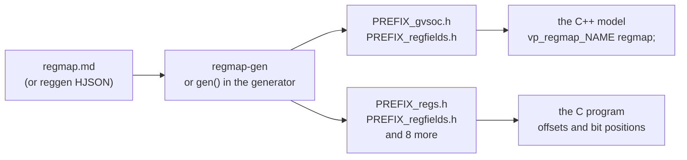

# Register maps with regmap-gen

How to describe the registers of a component once and have GVSoC generate
the C++ for the model and the C headers for the program. This page collects
what tutorial 5 (`docs/tutorials/5_register_map.md`) and the questions
around it turned up, with a worked `start` / `busy` example.

Written against gvsoc `93cedc4`. GVSoC has no documentation for this tool
beyond one paragraph in `tutorials.rst`; everything here was read from the
source or tried on the check machine (2-core Ubuntu 24.04, same pins,
outside the container). Each table says which.

## What it is

`regmap-gen` is a Python script in the gvsoc submodule, not a separate
install:

| Path | What |
|---|---|
| `gvsoc/engine/bin/regmap-gen` | The command-line script |
| `gvsoc/engine/python/regmap/` | Its module: one reader per input format, one writer per output format |
| `gvsoc/engine/python/regmap/regmap_md.py` | The Markdown reader; the format below is what this file accepts |
| `gvsoc/engine/engine/include/vp/register.hpp` | `vp::Register` and `vp::regmap`, the classes the generated code derives from |

Not to be confused with `reggen`, lowRISC's register tool. `regmap-gen` can
read reggen's HJSON files.



## How to call it

### From the command line

From the directory of the component:

```
PYTHONPATH=/work/gvsoc/engine/python /work/gvsoc/engine/bin/regmap-gen --input-md regmap.md --header headers/mycomp
```

It prints nothing and writes `headers/mycomp_*.h`. This form needs neither
the GVSoC build nor `sourceme.sh`. After a build and `source
gvsoc/sourceme.sh`, plain `regmap-gen ...` does the same: the build installs
the script in `build/install/bin` and the module in `build/install/python`.

Options that matter (all run):

| Option | Effect |
|---|---|
| `--input-md FILE` | Read a Markdown description (format below) |
| `--input-hjson FILE` | Read a reggen HJSON file. Run on the stock `gvsoc/pulp/pulp/snitch/snitch_cluster/snitch_cluster_peripheral_reg.hjson`: 52 register classes |
| `--header PREFIX` | Write the C and C++ headers as `PREFIX_*.h` |
| `--header-headers regfields,gvsoc` | Write only the named headers. `regfields,gvsoc` is what a model needs; add `regs` for the program |
| `--name NAME` | Name of the map, default `regmap`. It sets the class names (`vp_regmap_NAME`, `vp_NAME_<register>`) and the macro prefix (`NAME_<REGISTER>_...`) |
| `--rst FILE` | Write a register table for Sphinx documentation |
| `--json FILE` | Write the map as JSON |

Options that did not work or do something else at the pin: `--table` fails
with `AttributeError`; `--ipxact` works only when every field has a valid
`Access Type`; `--input-json` failed on a file lookup and was not pursued;
`--register NAME` is not a filter, it only changes the order of the
registers. `--input-xls` was not tried.

After a change in `regmap.md`: run the command again, then `make gvsoc`. The
model's four variants rebuild in about 6 s.

### From the generator, at build time

A component's Python generator can do the same during `make gvsoc`, so
there is no separate step and no generated file in the repository. This is
how the stock cluster peripheral does it
(`gvsoc/pulp/pulp/snitch/snitch_cluster/cluster_registers.py`, with HJSON).
Tried with tutorial 5's `regmap.md`:

```python
    # Called by the GVSoC build for every component of the target, before
    # the C++ models are compiled.
    def gen(self, builddir, installdir):
        import os
        import regmap.regmap
        import regmap.regmap_md
        import regmap.regmap_c_header

        md = os.path.join(os.path.dirname(os.path.abspath(__file__)), 'regmap.md')
        rmap = regmap.regmap.Regmap('regmap')
        regmap.regmap_md.import_md(rmap, md)
        regmap.regmap_c_header.dump_to_header(regmap=rmap, name='regmap',
            header_path=f'{builddir}/my_comp_gen/mycomp', headers=['regfields', 'gvsoc'])
```

The headers land in `build/build/engine/my_comp_gen/` and the model includes
them as `<my_comp_gen/mycomp_regfields.h>` and
`<my_comp_gen/mycomp_gvsoc.h>`. After an edit of `regmap.md`, `make gvsoc`
regenerates and rebuilds (7 s). For HJSON, use `regmap.regmap_hjson` and
`import_hjson` in place of the Markdown reader.

Two more hooks exist in the generator base class; read, not run: a
`regmap` property (`name`, `spec`, `header_prefix`, `headers`), as
`gvsoc/pulp/pulp/snitch/snitch_core.py` sets for `ssr.md`, and a helper
`self.regmap_gen(template, outdir, name)`.

## The regmap.md format

The reader looks for headings and for column names, not for positions.

```markdown
# Toy accelerator

## Registers

| Register Name | Offset | Size | Default    | Description |
| ---           | ---    | ---  | ---        | ---         |
| CTRL          | 0x00   | 32   | 0x00000000 | Control     |
| STATUS        | 0x04   | 32   | 0x00000000 | Status      |

### CTRL

| Field Name | Offset | Size | Access Type | Default | Description      |
| ---        | ---    | ---  | ---         | ---     | ---              |
| START      | 0      | 1    | RW          | 0       | Write 1 to start |
```

| Part | Rule | Checked |
|---|---|---|
| `# Title` | Required as the first heading. Without a level-1 heading the reader does not find `## Registers` | run |
| `## Registers` | Required, with one table under it. Other sections (`## Description`) are ignored | run |
| `Register Name` or `Name` | The register. Its lower-case form is the member name in the model (`regmap.ctrl`) | run |
| `Offset` or `Address` | Byte offset from the start of the map, not of the component | run |
| `Size` | Width in bits: 8, 16, 32 or 64. Gives `vp::Register<uint8_t>` to `<uint64_t>`. 32 when the column is missing | run |
| `Default` or `Reset Value` | The value written at reset | run |
| `Reset` | 0 turns the reset of this register off. On when the column is missing | run (header only) |
| `Description` or `Short description` | Text for the generated comments | run |
| `Properties` | `template=NAME`: the register takes its fields from section `### NAME`, so several registers can share one field table | run |
| `### <register name>` | The fields of one register, as a table. A `#### Fields` heading above the table is optional. A register without a section has no fields | run |
| `Field Name` | The field. Gives `<field>_get()` and `<field>_set(v)` on the register | run |
| `Offset`, `Bit` or `Bit Position` | First bit of the field | run |
| `Size` or `Width` | Width of the field in bits | run |
| `Access Type` or `Host Access Type` | `R` marks the field read-only in the generated write mask. Not enforced by the model (see below) | run |
| `Default` or `Reset Value` (field) | Only used for a `..._RESET` macro. It does not change the register's reset value | run |
| Numbers | Decimal or `0x` hex | run |

Column order does not matter, column names are not case-sensitive, and
extra columns are ignored. Two real files in the tree are good models:
`gvsoc/core/models/devices/sound/dac/ssm6515/regmap.md` and
`gvsoc/pulp/pulp/snitch/archi/ssr.md`. A `## Commands` section also exists
in the reader; read, not run.

## What the tool does not check

All run, except where a cell says read.

| Input | What happens |
|---|---|
| Two registers at overlapping offsets | Accepted. From the source, `regmap.access` then serves the first one in the table that contains the access (read) |
| A field that runs past the register's width, or two overlapping fields | Accepted |
| A misspelled column name (`Offsett`) | The column counts as missing and the reader takes the last column in its place: `ValueError: invalid literal for int() with base 0: 'Register 0'` |
| No `Access Type` column | The description text is stored as the access type. Harmless for the model; breaks `--ipxact` |
| `Access Type` `R` | The header gets a write mask, but `vp::Register` does not apply it: a store of `0xffffffff` reads back `0xffffffff`. Read-only needs a callback (example below) |

A description written by a script should therefore be checked by that
script: offsets, overlaps, field ranges.

## What is generated

`--header headers/mycomp` writes 12 files. Opened on the check machine:

| File | Content | Use |
|---|---|---|
| `mycomp_gvsoc.h` | One C++ class per register (`vp::Register<T>` with name, offset, width, reset value, fields and `<field>_get` / `_set`), and the map class `vp_regmap_<name>` | Model |
| `mycomp_regfields.h` | `<NAME>_<REG>_<FIELD>_BIT`, `_WIDTH`, `_MASK`, `_RESET` macros | Model and program |
| `mycomp_regs.h` | `<NAME>_<REG>_OFFSET` macros | Program; used in the example below |
| `mycomp_structs.h` | One bit-field union per register | Program; not tried |
| `mycomp_regmap.h` | A struct with one `volatile` member per register | Program; not tried |
| `mycomp_accessors.h`, `mycomp_regfields_accessors.h`, `mycomp_macros.h` | Inline functions and macros built on `GAP_READ`, `GAP_WRITE`, `GAP_BINSERT`, which come from the GreenWaves runtime and are not in `tutorials/utils` | Not usable here as they are |
| `mycomp_groups.h`, `mycomp_constants.h`, `mycomp_cmd.h` | Empty for a map without groups, constants or commands | |
| `mycomp.h` | Includes all the program headers, the `GAP_` ones too | Not usable here as it is |

The model includes `_regfields.h` first, then `_gvsoc.h`; the classes use
the macros. The classes are inside `#ifdef __GVSOC__`, which the model build
defines.

## Using the map in a model

| Call | What it does | Checked |
|---|---|---|
| `vp_regmap_<name> regmap;` and `regmap(*this, "regmap")` in the initializer list | The map, a `vp::Block`. Registers get the paths `<component>/regmap/<register>` | run |
| `regmap.build(this, &this->trace)` | Stores the trace on which an unknown offset is reported. Without it that report would abort | run; the abort is read |
| `regmap.access(offset, size, data, is_write)` | Finds the register that contains `offset .. offset+size-1` and reads or writes it, through its callback if it has one. Returns `true` when no register matches, after printing `Accessing invalid register`; with the default `werror` that message ends the run with exit code 1 (`--no-werror` to go on) | run |
| `regmap.<reg>.get()`, `.set(v)` | The full value. `set` goes straight to the value, not through the callback | run |
| `regmap.<reg>.<field>_get()`, `<field>_set(v)` | One field | run |
| `regmap.<reg>.register_callback(fn, exec_on_reset)` | `fn(uint64_t reg_offset, int size, uint8_t *value, bool is_write)` replaces the default read and write of this register, for loads as well as stores. With `exec_on_reset` true it is also called when the register is reset | run |
| `regmap.<reg>.update(reg_offset, size, value, is_write)` | The read or write itself, to be called from the callback. Byte offset inside the register, number of bytes, the request's data pointer, direction. No bounds check | run |

Traces: `--trace=<component>/regmap --trace-level=debug` prints every
access with the value split into fields; `--trace-level=trace` adds
`Modified register`. With `--vcd --event=<component>` each register is a
signal in the VCD.

## Worked example: start, status, a parameter and a result

A component whose whole window is a generated map. A store of 1 to
`CTRL.START` runs the "accelerator": it reads `N`, writes `RESULT`, sets
`STATUS.DONE` and counts the run. There is no time in it yet (tutorial 6),
so the run finishes inside the store and `BUSY` never reads 1. Built and
run on the check machine, in place of tutorial 5's `my_comp`.

`regmap.md`:

```markdown
# Toy accelerator

## Registers

| Register Name | Offset | Size | Default    | Description                       |
| ---           | ---    | ---  | ---        | ---                               |
| CTRL          | 0x00   | 32   | 0x00000000 | Control                           |
| STATUS        | 0x04   | 32   | 0x00000000 | Status, read-only for the program |
| N             | 0x08   | 32   | 0x00000010 | Number of elements                |
| RESULT        | 0x0C   | 32   | 0x00000000 | Result of the last run            |

### CTRL

| Field Name | Offset | Size | Access Type | Default | Description               |
| ---        | ---    | ---  | ---         | ---     | ---                       |
| START      | 0      | 1    | RW          | 0       | Write 1 to start; reads 0 |

### STATUS

| Field Name | Offset | Size | Access Type | Default | Description          |
| ---        | ---    | ---  | ---         | ---     | ---                  |
| BUSY       | 0      | 1    | R           | 0       | A run is in progress |
| DONE       | 1      | 1    | R           | 0       | A run has finished   |
| RUNS       | 8      | 8    | R           | 0       | Number of runs       |
```

Generate, with a name and only the three headers needed:

```
PYTHONPATH=/work/gvsoc/engine/python /work/gvsoc/engine/bin/regmap-gen --input-md regmap.md --name acc --header headers/acc --header-headers regs,regfields,gvsoc
```

`my_comp.cpp`:

```cpp
#include <vp/vp.hpp>
#include <vp/itf/io.hpp>
#include "headers/acc_regfields.h"
#include "headers/acc_gvsoc.h"

class MyComp : public vp::Component
{
public:
    MyComp(vp::ComponentConf &config);

private:
    static vp::IoReqStatus handle_req(vp::Block *__this, vp::IoReq *req);
    void ctrl_access(uint64_t reg_offset, int size, uint8_t *value, bool is_write);
    void status_access(uint64_t reg_offset, int size, uint8_t *value, bool is_write);

    vp::IoSlave input_itf;
    vp::Trace trace;
    // Class name: vp_regmap_<name>, from regmap-gen --name acc.
    vp_regmap_acc regmap;
};

MyComp::MyComp(vp::ComponentConf &config)
    : vp::Component(config), regmap(*this, "regmap")
{
    this->input_itf.set_req_meth(&MyComp::handle_req);
    this->new_slave_port("input", &this->input_itf);
    this->traces.new_trace("trace", &this->trace);

    this->regmap.build(this, &this->trace);

    // No `true` as last argument: these callbacks are not called at reset,
    // so the reset values of the table are written directly.
    this->regmap.ctrl.register_callback(std::bind(&MyComp::ctrl_access, this,
        std::placeholders::_1, std::placeholders::_2, std::placeholders::_3,
        std::placeholders::_4));
    this->regmap.status.register_callback(std::bind(&MyComp::status_access, this,
        std::placeholders::_1, std::placeholders::_2, std::placeholders::_3,
        std::placeholders::_4));
}

// CTRL: a write with START=1 runs the "accelerator". There is no time yet
// (tutorial 6), so the run starts and finishes inside this call.
void MyComp::ctrl_access(uint64_t reg_offset, int size, uint8_t *value, bool is_write)
{
    // Do the read or the write itself first.
    this->regmap.ctrl.update(reg_offset, size, value, is_write);

    if (is_write && this->regmap.ctrl.start_get())
    {
        uint32_t n = this->regmap.n.get();

        this->trace.msg(vp::TraceLevel::INFO, "Start (n: %d)\n", n);

        this->regmap.result.set(n * 2);
        this->regmap.status.done_set(1);
        this->regmap.status.runs_set(this->regmap.status.runs_get() + 1);

        // START is a pulse: it reads back as 0.
        this->regmap.ctrl.start_set(0);
    }
}

// STATUS: read-only for the program. The model writes it with the field
// setters above, which do not go through this callback.
void MyComp::status_access(uint64_t reg_offset, int size, uint8_t *value, bool is_write)
{
    if (!is_write)
    {
        this->regmap.status.update(reg_offset, size, value, false);
    }
}

vp::IoReqStatus MyComp::handle_req(vp::Block *__this, vp::IoReq *req)
{
    MyComp *_this = (MyComp *)__this;

    // access() returns true when no register contains the access.
    bool error = _this->regmap.access(req->get_addr(), req->get_size(), req->get_data(),
        req->get_is_write());

    return error ? vp::IO_REQ_INVALID : vp::IO_REQ_OK;
}

extern "C" vp::Component *gv_new(vp::ComponentConf &config)
{
    return new MyComp(config);
}
```

`main.c`, using the generated offsets and bit positions:

```c
#include <stdio.h>
#include <stdint.h>
#include "headers/acc_regs.h"
#include "headers/acc_regfields.h"

#define ACC_BASE 0x20000000
#define REG(offset) (*(volatile uint32_t *)(ACC_BASE + (offset)))

int main()
{
    printf("reset: n=%d status=0x%x\n", REG(ACC_N_OFFSET), REG(ACC_STATUS_OFFSET));

    REG(ACC_N_OFFSET) = 21;
    REG(ACC_STATUS_OFFSET) = 0xffffffff;
    REG(ACC_CTRL_OFFSET) = 1 << ACC_CTRL_START_BIT;

    uint32_t status = REG(ACC_STATUS_OFFSET);
    printf("after start: ctrl=0x%x status=0x%x done=%d runs=%d result=%d\n",
        REG(ACC_CTRL_OFFSET), status,
        (status >> ACC_STATUS_DONE_BIT) & 1,
        (status & ACC_STATUS_RUNS_MASK) >> ACC_STATUS_RUNS_BIT,
        REG(ACC_RESULT_OFFSET));

    return 0;
}
```

`make gvsoc all run` prints:

```
reset: n=16 status=0x0
after start: ctrl=0x0 status=0x102 done=1 runs=1 result=42
```

What the output shows:

- `n=16`: the `Default` of the register table is the reset value.
- `status=0x102` after the program stored `0xffffffff` to it: the callback
  made the register read-only. `0x102` is `DONE` (bit 1) and `RUNS` = 1
  (bits 8 to 15).
- `ctrl=0x0`: `START` reads back as 0.
- `result=42`: the callback read `N` (21) and wrote `RESULT`.

With `--trace=my_comp --trace-level=debug`, the store to `CTRL` at cycle
1400:

```
14000000: 1400: [/soc/my_comp/trace              ] Start (n: 21)
14000000: 1400: [/soc/my_comp/regmap/ctrl/trace  ] Register access (name: CTRL, offset: 0x0, size: 0x4, is_write: 0x1, value: { START=0x0 })
14010000: 1401: [/soc/my_comp/regmap/status/trace] Register access (name: STATUS, offset: 0x4, size: 0x4, is_write: 0x0, value: { BUSY=0x0, DONE=0x1, RUNS=0x1 })
```

## For SNAX-GVSoC

- One description gives the model's map and the program's offsets, so the
  two cannot drift apart. SNAX-FORGE already derives an accelerator's
  register list from its interface; writing it out as `regmap.md` or HJSON
  and generating through `gen()` would need no manual step.
- What stays hand-written is the behaviour: the callbacks, once per kind of
  block.
- The map is compiled into the model. A new register layout is a rebuild of
  that model (seconds); a new value is not.
- SNAX programs its accelerators with `csrw`, not with memory-mapped
  stores. `regmap.access` does not care where an access comes from, but how
  a custom CSR access leaves the GVSoC core is open (GVS2).
