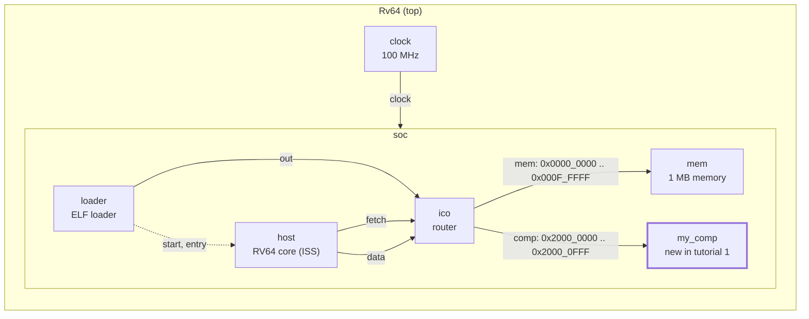

# Tutorial 1: a component from scratch

You write your own model: a C++ class and a small Python generator. You map
it at `0x20000000` in the system of tutorial 0 and read it from the program.
This is the smallest version of the register side of an accelerator.

This is GVSoC developer tutorial 1, written against the pinned source (gvsoc
`93cedc4`). The text in GVSoC's `tutorials.rst` matches the `solution/`
directory here, with one slip: it declares the handler once with
`void *__this`, and it must be `vp::Block *__this`.

Time: about 30 minutes, of which 2 to 4 minutes is the build.

## What you need

- The snax-gvsoc container, with the repo mounted at `/work` and
  `GVSOC_WORKDIR=/work/build` (see `docs/notes/NOTES.md`).
- Tutorial 0 done (`docs/tutorials/0_system_from_scratch.md`), with
  `tutorials/utils` in place.

In every new container:

```
source gvsoc/sourceme.sh
export GVSOC_ROOT=/work/gvsoc
```

## The system

Tutorial 0's system with one more router output:



Inside `soc`, solid arrows are `io` bindings (memory-mapped requests) and
the dotted one stands for two `wire` bindings; the arrow into `soc` is the
`clock` binding. Edge labels are port names. The arrow points from
the master port to the slave port.

| Instance | Generator class | What it is |
|---|---|---|
| `soc/my_comp` | `my_comp.MyComp` (new) | Returns a fixed 32-bit value on a read at offset 0 |

The files you add:

| File | What |
|---|---|
| `my_comp.py` | The generator: sources, parameters, ports |
| `my_comp.cpp` | The model |
| `my_system.py` | Tutorial 0's system plus two lines |

Compared with tutorial 0's `my_system.py`, the one here has no `Gdbserver`
inside `Soc`, no `o_DATA_DEBUG` binding and no `GAPY_TARGET = True`. None of
them is needed: nothing in the pinned tree reads `GAPY_TARGET`.

## Step 1: copy the tutorial out of the GVSoC tree

From `/work`:

```
cd tutorials
T=/work/gvsoc/engine/docs/developer_manual/tutorials
cp -r $T/1_how_to_write_a_component_from_scratch .
cd 1_how_to_write_a_component_from_scratch
```

The directory holds `Makefile`, `main.c`, `my_system.py` (tutorial 0's
system, without the component), `testset.cfg` and `solution/`.

`main.c` is already the new program:

```c
int main()
{
    printf("Hello, got 0x%x from my comp\n", *(uint32_t *)0x20000000);
    return 0;
}
```

## Step 2: write the generator

Create `my_comp.py` next to the `Makefile`. `make prepare` copies it, the
C++ file and the finished `my_system.py` from `solution/`; the content is
below either way.

```python
import gvsoc.systree

class MyComp(gvsoc.systree.Component):

    def __init__(self, parent: gvsoc.systree.Component, name: str, value: int):
        super().__init__(parent, name)

        self.add_sources(['my_comp.cpp'])

        self.add_properties({
            "value": value
        })

    def i_INPUT(self) -> gvsoc.systree.SlaveItf:
        return gvsoc.systree.SlaveItf(self, 'input', signature='io')
```

- **`parent` and `name`** are passed by every generator to the base class.
  Any other argument (`value` here) is a parameter of your own.
- **`add_sources`** names the C++ files of the model. This is all the build
  needs to compile the component into its own library.
- **`add_properties`** puts the parameter in the JSON configuration, where
  the C++ code reads it.
- **`i_INPUT`** declares the input port for whoever instantiates the
  component. `'input'` must be the name used in the C++ code, and `'io'` is
  the type that GVSoC checks on a binding.

## Step 3: write the model

Create `my_comp.cpp`:

```cpp
#include <vp/vp.hpp>
#include <vp/itf/io.hpp>

class MyComp : public vp::Component
{

public:
    MyComp(vp::ComponentConf &config);

private:
    static vp::IoReqStatus handle_req(vp::Block *__this, vp::IoReq *req);

    vp::IoSlave input_itf;

    uint32_t value;
};


MyComp::MyComp(vp::ComponentConf &config)
    : vp::Component(config)
{
    this->input_itf.set_req_meth(&MyComp::handle_req);
    this->new_slave_port("input", &this->input_itf);

    this->value = this->get_js_config()->get_child_int("value");
}

vp::IoReqStatus MyComp::handle_req(vp::Block *__this, vp::IoReq *req)
{
    MyComp *_this = (MyComp *)__this;

    printf("Received request at offset 0x%lx, size 0x%lx, is_write %d\n",
        req->get_addr(), req->get_size(), req->get_is_write());
    if (!req->get_is_write() && req->get_addr() == 0 && req->get_size() == 4)
    {
        *(uint32_t *)req->get_data() = _this->value;
    }
    return vp::IO_REQ_OK;
}


extern "C" vp::Component *gv_new(vp::ComponentConf &config)
{
    return new MyComp(config);
}
```

- **The class** inherits from `vp::Component`. `config` is only passed on to
  the base class.
- **The port** is a `vp::IoSlave` member. The constructor gives it a handler
  with `set_req_meth` and registers it under a name with `new_slave_port`.
- **The handler** is a static function, because a port stores a plain
  function pointer. It gets the instance as its first argument, hence the
  cast to `MyComp *`.
- **The request** carries the address (already a local offset, the router
  removed the base), the size, the direction and a pointer to the data
  buffer of the master. For a read, the model writes into that buffer.
- **`IO_REQ_OK`** means the request is done now.
- **`gv_new`** is the C function that the engine calls to create the
  instance when it loads the library.

## Step 4: add the component to the system

In `my_system.py`, add the import at the top:

```python
import my_comp
```

and in `Soc`, after the `mem` mapping:

```python
        comp = my_comp.MyComp(self, 'my_comp', value=0x12345678)
        ico.o_MAP(comp.i_INPUT(), 'comp', base=0x20000000, size=0x00001000, rm_base=True)
```

## Step 5: build GVSoC for this system

```
make gvsoc 2>&1 | tee /work/build/t1_build.log | grep my_comp
```

Expected: four compile lines and four install lines for the new model, one
per build variant (`optim`, `debug`, `asserts`, `profile`):

```
[ 11%] Building CXX object engine/CMakeFiles/gen_my_comp_cpp_<hash>_debug.dir/.../my_comp.cpp.o
...
-- Installing: /work/build/install/models/gen_my_comp_cpp_<hash>.so
-- Installing: /work/build/install/models/asserts/gen_my_comp_cpp_<hash>.so
-- Installing: /work/build/install/models/profile/gen_my_comp_cpp_<hash>.so
-- Installing: /work/build/install/models/debug/gen_my_comp_cpp_<hash>.so
```

The hash was `221325801` on the check machine; it may differ with another
path.

This build is not short: 4 min 1 s on 2 cores, 197 files, the same as a
first build of tutorial 0. The tutorial directory is passed to the build as
a module root (`MODULES=$(CURDIR)`), which is an include path of every
model. Moving from tutorial 0's directory to this one changes that path, so
all models of `my_system` recompile, the RV64 core included. Expect this once
per tutorial. Rebuilds inside one tutorial are short; see step 9.

## Step 6: compile the program and run it

```
make all
make run
```

Expected: the `gvrun` command line, then

```
Received request at offset 0x0, size 0x4, is_write 0
Hello, got 0x12345678 from my comp
```

The first line is the `printf` in the model, the second the `printf` in the
simulated program.

## Step 7: see the access in the traces

```
make run runner_args="--trace=insn --trace=ico" 2>&1 | grep -B2 -A1 "Received request"
```

Expected (colour codes and padding removed):

```
1570000: 157: [/soc/host/insn] main:6  M 0000000000002f28 lui   a5, 0x20000000   a5=0000000020000000
1580000: 158: [/soc/ico/trace] Received IO req (offset: 0x20000000, size: 0x4, is_write: 0)
Received request at offset 0x0, size 0x4, is_write 0
1580000: 158: [/soc/host/insn] main:6  M 0000000000002f2c c.lw  a1, 0(a5)   a1=0000000012345678  a5:0000000020000000  PA:0000000020000000
```

The router receives the request with the full address, the model receives
it with offset 0, and the load ends with the value in `a1`. All three are in
cycle 158.

The router's address table and the ports of the model:

```
make run runner_args="--trace=ico" 2>&1 | grep -A2 "Building router table"
make run runner_args="--trace=my_comp" 2>&1 | grep "New .* port"
```

Expected: the two ranges, `0x0 : 0x100000 -> mem` and
`0x20000000 : 0x20001000 -> comp`; then five slave ports, of which `clock`,
`reset`, `power_supply` and `voltage` come from the base class and `input`
is ours.

## Step 8: look at what the build and the run produced

```
grep -n my_comp /work/build/build/gvsoc/configs/my_system.tree.cpp
grep -n my_comp /work/build/build/gvsoc/configs/my_system.config
grep -n '"my_comp"' -A5 /work/build/work/gvsoc_config.json
```

Expected:

- `my_system.tree.cpp`: the binding
  `{"ico", "comp", "my_comp", "input", "io", "io"}` and the instance
  `{"my_comp", nullptr, nullptr, 0, "gen_my_comp_cpp_<hash>", ...}`.
- `my_system.config`: `gen_my_comp_cpp_<hash>` in `CONFIG_COMPONENTS`, and
  `CONFIG_SRCS_gen_my_comp_cpp_<hash>=` with the full path of `my_comp.cpp`.
- `gvsoc_config.json`: `"value": 305419896` (0x12345678) and
  `"ports": ["input"]`.

## Step 9: what needs a rebuild

**The value: no rebuild.** In `my_system.py`, change `value=0x12345678` to
`value=0xcafe0001`, then only:

```
make run
```

Expected: `Hello, got 0xcafe0001 from my comp`, with no platform tree
warning. The value is only in `gvsoc_config.json`, which is written at every
run; the second field of the `my_comp` line in `my_system.tree.cpp` is
`nullptr`, so the compiled tree holds no parameter for it. Change it back.

**The C++: a short rebuild.** Edit `my_comp.cpp` (for example the text of
the `printf`), then:

```
make gvsoc
make run
```

Expected: 4 files compiled (the model, once per variant), about 7 s on 2
cores. The library keeps its name: the hash covers the source names and the
compile flags, not the content of the file.

## How it works

**From generator to library.** `add_sources(['my_comp.cpp'])` adds a
component entry to `my_system.config`. The path is looked up in the module
roots, and the Makefile passes the tutorial directory as one
(`MODULES=$(CURDIR)` at build time, `--target-dir=$(CURDIR)` at run time).
That is also why `import my_comp` works. CMake builds one shared library per
entry, in four variants; a normal run loads the one directly in
`build/install/models`.

**From library to instance.** At start the engine walks the platform tree.
For `my_comp` it opens `gen_my_comp_cpp_<hash>.so`, looks up the C symbol
`gv_new` and calls it (`gvsoc/engine/engine/src/component.cpp`). The
constructor runs, creates the port and reads `value` from the JSON
configuration of this instance with `get_js_config()`.

**Binding.** After all instances exist, the engine connects the ports listed
in the tree. For an `io` binding this copies the slave's handler pointer and
instance pointer into the master port. The `--trace=ico` output shows it:
`Creating final binding (/soc/ico:comp -> /soc/my_comp:input)`.

**A request is a function call.** There is no event and no queue. The
master's `req()` is one indirect call
(`gvsoc/engine/engine/include/vp/itf/io.hpp`, `IoMaster::req`):

```
core, executing c.lw
  -> Router::handle_req       finds the mapping, subtracts the base
     -> MyComp::handle_req    writes the value into the buffer, returns IO_REQ_OK
  <- IO_REQ_OK
```

The router does not copy anything: it changes the address in the request and
passes the same request on (`req_forward`). The whole chain runs inside the
core's execution of that one instruction, which is why step 7 shows
everything in cycle 158.

**Timing.** `IO_REQ_OK` with nothing else set means zero added latency. The
request also has a latency field and there is an `IO_REQ_PENDING` status for
answers that come later; tutorial 7 covers both.

**What the model does not do.** The handler returns `IO_REQ_OK` for every
request and only acts on a 4-byte read at offset 0. Tried on this system:

| Access from the program | What happens |
|---|---|
| 4-byte read at offset 4 | `IO_REQ_OK`, buffer untouched: the program gets stale data (`0x978` in the run) |
| 1-byte read at offset 0 | Same, the size check fails: reads `0x0` |
| 4-byte write at offset 0 | Accepted and dropped; the next read still gives the value |
| Read at `0x30000000`, not mapped | The router returns `IO_REQ_INVALID`; see below |

**`IO_REQ_INVALID`.** A model that returns `vp::IO_REQ_INVALID` for accesses
it does not handle makes the error visible. On this RV64 core the load then
raises a load fault, the runtime's `handle_exception` calls `exit(1)`, and
`gvrun` ends with:

```
Input error: Platform returned an error (exitcode: 1)
```

There is no message that names the address; `--trace=insn` shows the jump to
`handle_exception` right after the load. The stricter handler, tried here:

```cpp
    if (!req->get_is_write() && req->get_addr() == 0 && req->get_size() == 4)
    {
        *(uint32_t *)req->get_data() = _this->value;
        return vp::IO_REQ_OK;
    }
    return vp::IO_REQ_INVALID;
```

This was not tried on the Snitch target, whose core may treat an invalid
access differently.

## SNAX-MODEL counterparts

| GVSoC | SNAX-MODEL |
|---|---|
| `MyComp` behind a router mapping | A register window with one read-only register |
| `value` passed in `my_system.py`, stored in `gvsoc_config.json` | A field of the accelerator entry in the cluster file, resolved into the design point |
| `handle_req` called by the master | A register read served by the window at the time of the access |

One difference to keep in mind: the handler has no time of its own. It runs
inside the instruction of the core that sends the request. A model that
works over several cycles needs clock events, which is tutorial 6.

## Things that can go wrong

- **`ModuleNotFoundError: No module named 'my_comp'`**, then
  `Dependency 'my_comp' of the target module 'my_system' is missing`, during
  `make gvsoc`: `my_comp.py` is not next to `my_system.py`.
- **`couldn't find gv_new loaded module (module: gen_my_comp_cpp_<hash>)`**
  at run time, exit code 134: the `extern "C" gv_new` function is missing
  from `my_comp.cpp`. The build passes without it.
- **`Binding from invalid slave port`** at start: the name in `i_INPUT`
  (`'input'`) is not the name given to `new_slave_port`.
- **`Invalid signature`**: the signature in `i_INPUT` is not `'io'`.
- **`Input error: Platform returned an error (exitcode: 1)`** with no other
  message: the program took a load or store fault. Either the address is not
  in the router map (check `base` and `size` in `o_MAP`), or a model returned
  `IO_REQ_INVALID`. A mapping smaller than the access also ends this way:
  the router splits the request and the second part is not mapped.
- **The program reads a wrong value and nothing complains**: the access did
  not match what the handler checks (offset, size, direction), and the
  handler returned `IO_REQ_OK` anyway.
- **The value does not change after an edit of `my_system.py`** when the
  commands are run from a script in quick succession: delete `__pycache__/`
  next to the generator first.
- **The build takes minutes after switching tutorials**: expected, see
  step 5.

## Files

| Path | What |
|---|---|
| `tutorials/1_how_to_write_a_component_from_scratch/my_comp.py` | The generator of the component |
| `tutorials/1_how_to_write_a_component_from_scratch/my_comp.cpp` | The model |
| `tutorials/1_how_to_write_a_component_from_scratch/my_system.py` | The system |
| `tutorials/1_how_to_write_a_component_from_scratch/main.c` | The program |
| `build/install/models/gen_my_comp_cpp_<hash>.so` | The compiled model |
| `build/build/gvsoc/configs/my_system.config` | Models to build |
| `build/build/gvsoc/configs/my_system.tree.cpp` | Instances and bindings |
| `build/work/gvsoc_config.json` | Properties of this run, with `value` |

`build/test/test`, `build/work/` and the `my_system` build are shared with
tutorial 0 and overwritten by this one.