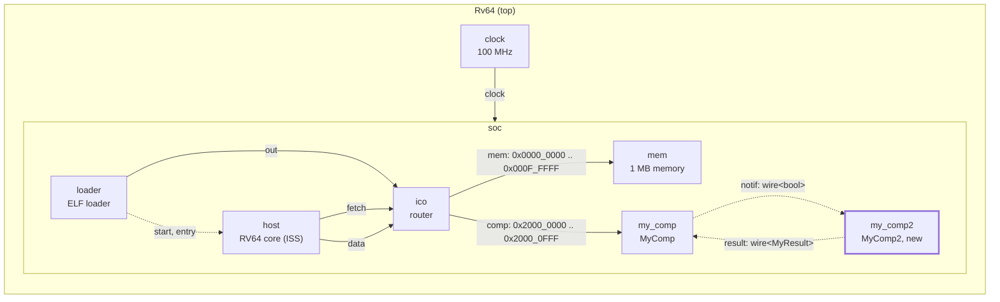
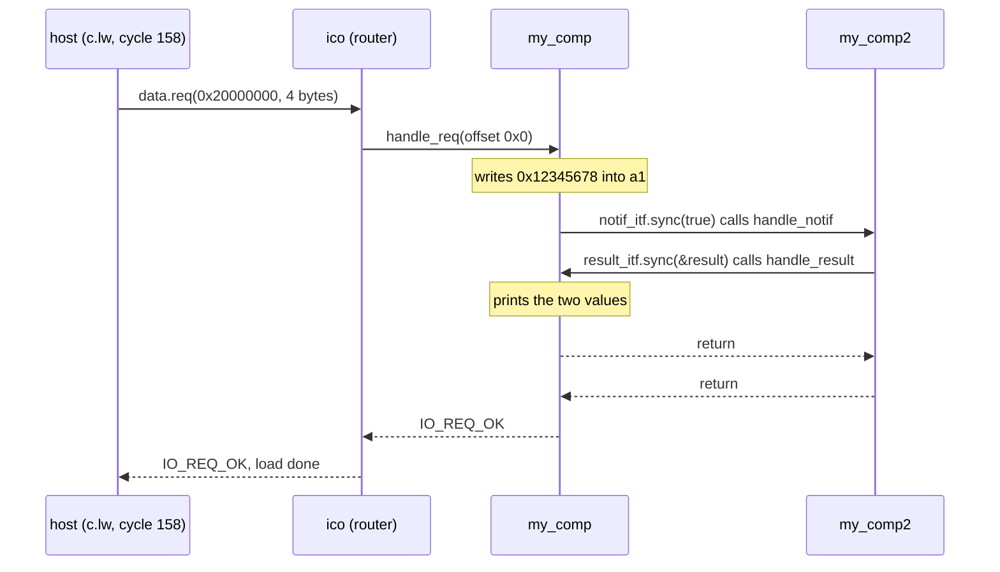

# Tutorial 2: components communicating

You add a second component and connect the two with wires. When the core
reads `my_comp`, `my_comp` sends a notification to `my_comp2` on one wire,
and `my_comp2` answers on another wire with a small C++ object. Wires are how
a controller and an accelerator exchange `start`, `busy` and interrupts.

This is GVSoC developer tutorial 2, written against the pinned source (gvsoc
`93cedc4`). The text in `tutorials.rst` uses an old module alias (`gsystree`)
and declares the handlers with `void *__this`; the `solution/` directory is
the working reference and this page follows it.

Time: about 30 minutes, of which about 4 minutes is the build.

## What you need

- The snax-gvsoc container, with the repo mounted at `/work` and
  `GVSOC_WORKDIR=/work/build` (see `docs/notes/NOTES.md`).
- Tutorial 1 done (`docs/tutorials/1_component_from_scratch.md`).

In every new container:

```
source gvsoc/sourceme.sh
export GVSOC_ROOT=/work/gvsoc
```

## The system

Tutorial 1's system with a second component, wired to the first:



Solid arrows are `io` bindings and the clock; dotted arrows are `wire`
bindings, from master port to slave port, labelled with the port name and
the signature.

| Instance | Generator class | What it is |
|---|---|---|
| `soc/my_comp` | `my_comp.MyComp` (extended) | Tutorial 1's component, plus a `notif` output wire and a `result` input wire |
| `soc/my_comp2` | `my_comp.MyComp2` (new) | Receives `notif`, answers on `result` |

The files:

| File | Change |
|---|---|
| `my_class.hpp` | New: the type sent on the `result` wire |
| `my_comp.cpp` | Two ports and one handler added |
| `my_comp2.cpp` | New: the second model |
| `my_comp.py` | Two port methods added, and the `MyComp2` generator |
| `my_system.py` | Three lines: create `my_comp2` and bind both wires |

## Step 1: copy the tutorial out of the GVSoC tree

From `/work`:

```
cd tutorials
T=/work/gvsoc/engine/docs/developer_manual/tutorials
cp -r $T/2_how_to_make_components_communicate_together .
cd 2_how_to_make_components_communicate_together
```

The directory starts where tutorial 1 ended: `my_system.py` is tutorial 1's
solution, and `my_comp.py` and `my_comp.cpp` are tutorial 1's component with
two small differences in the C++: it already includes `vp/itf/wire.hpp`, and
the handler answers a 4-byte read at any offset, not only at 0. `main.c` is
the same program.

`make prepare` copies the five finished files from `solution/`. The versions
below are the same code with comments added; they build and run the same.

## Step 2: the type on the wire

Create `my_class.hpp`:

```cpp
#pragma once

// The data that MyComp2 sends back to MyComp over the "result" wire.
// Any C++ type can travel over a wire; here a pointer to this class does.
class MyClass
{
public:
    uint32_t value0;
    uint32_t value1;
};
```

A wire is a C++ template, so it can carry any type: a `bool`, an integer, or
a pointer to an object as here. Both models include this header so they
agree on the layout.

## Step 3: extend the first model

Replace `my_comp.cpp` with:

```cpp
#include <vp/vp.hpp>
#include <vp/itf/io.hpp>
// wire.hpp: the wire port type, vp::WireMaster<T> and vp::WireSlave<T>.
#include <vp/itf/wire.hpp>
// The type carried by the "result" wire, shared with my_comp2.cpp.
#include "my_class.hpp"

class MyComp : public vp::Component
{

public:
    MyComp(vp::ComponentConf &config);

private:
    static vp::IoReqStatus handle_req(vp::Block *__this, vp::IoReq *req);
    // Called when MyComp2 sends a value on the "result" wire. Same pattern as
    // handle_req: static, instance as first argument, then the value.
    static void handle_result(vp::Block *__this, MyClass *result);

    vp::IoSlave input_itf;
    // Output wire carrying a bool. A master port sends; it has no handler.
    vp::WireMaster<bool> notif_itf;
    // Input wire carrying a MyClass pointer. A slave port receives; it needs
    // a handler.
    vp::WireSlave<MyClass *> result_itf;

    uint32_t value;
};


MyComp::MyComp(vp::ComponentConf &config)
    : vp::Component(config)
{
    this->input_itf.set_req_meth(&MyComp::handle_req);
    this->new_slave_port("input", &this->input_itf);

    // Register the output wire as "notif" (o_NOTIF in my_comp.py).
    this->new_master_port("notif", &this->notif_itf);

    // Give the input wire its handler, then register it as "result"
    // (i_RESULT in my_comp.py).
    this->result_itf.set_sync_meth(&MyComp::handle_result);
    this->new_slave_port("result", &this->result_itf);

    this->value = this->get_js_config()->get_child_int("value");
}

vp::IoReqStatus MyComp::handle_req(vp::Block *__this, vp::IoReq *req)
{
    MyComp *_this = (MyComp *)__this;

    printf("Received request at offset 0x%lx, size 0x%lx, is_write %d\n",
        req->get_addr(), req->get_size(), req->get_is_write());
    if (!req->get_is_write() && req->get_size() == 4)
    {
        *(uint32_t *)req->get_data() = _this->value;

        // Send true on the notif wire. This calls MyComp2::handle_notif right
        // now, which itself calls our handle_result before sync() returns.
        // The wire must be bound: sync() on an unbound wire crashes.
        _this->notif_itf.sync(true);
    }
    return vp::IO_REQ_OK;
}

void MyComp::handle_result(vp::Block *__this, MyClass *result)
{
    // The pointer is only valid during this call: it points to a local
    // variable of MyComp2::handle_notif. Copy what you need to keep.
    printf("Received results %x %x\n", result->value0, result->value1);
}

extern "C" vp::Component *gv_new(vp::ComponentConf &config)
{
    return new MyComp(config);
}
```

What is new compared with tutorial 1:

| Line | What it does |
|---|---|
| `#include <vp/itf/wire.hpp>` | The wire port types, `vp::WireMaster<T>` and `vp::WireSlave<T>` (implemented in `vp/itf/implem/wire_class.hpp`). |
| `vp::WireMaster<bool> notif_itf;` | An output wire. A master port sends values with `sync()`; it has no handler of its own. |
| `vp::WireSlave<MyClass *> result_itf;` | An input wire. A slave port receives values; it needs a handler. |
| `static void handle_result(vp::Block *__this, MyClass *result);` | The handler for `result`. Same pattern as `handle_req`: static, the instance as first argument, then the value. It returns nothing; a wire has no status and no latency. |
| `this->new_master_port("notif", &this->notif_itf);` | Registers the output under the name `notif`, which `o_NOTIF` in `my_comp.py` binds. |
| `this->result_itf.set_sync_meth(&MyComp::handle_result);` | Stores the handler in the input port, as `set_req_meth` does for an `io` port. |
| `this->new_slave_port("result", &this->result_itf);` | Registers the input under the name `result`, which `i_RESULT` returns. |
| `_this->notif_itf.sync(true);` | Sends `true`. This is a direct call into `MyComp2::handle_notif`, made now, inside the core's load. |
| `printf("Received results ...", result->value0, ...)` | Uses the object while the call lasts. The pointer points into the sender's stack, so it is not valid after the handler returns. |

## Step 4: write the second model

Create `my_comp2.cpp`:

```cpp
#include <vp/vp.hpp>
#include <vp/itf/wire.hpp>
#include "my_class.hpp"

// The class is also called MyComp, as in my_comp.cpp. That is allowed: each
// model is compiled into its own library and created through its own gv_new.
class MyComp : public vp::Component
{

public:
    MyComp(vp::ComponentConf &config);

private:
    static void handle_notif(vp::Block *__this, bool value);
    // The mirror image of MyComp: the bool wire comes in, the result goes out.
    vp::WireSlave<bool> notif_itf;
    vp::WireMaster<MyClass *> result_itf;
};


MyComp::MyComp(vp::ComponentConf &config)
    : vp::Component(config)
{
    this->notif_itf.set_sync_meth(&MyComp::handle_notif);
    this->new_slave_port("notif", &this->notif_itf);

    this->new_master_port("result", &this->result_itf);
}


void MyComp::handle_notif(vp::Block *__this, bool value)
{
    MyComp *_this = (MyComp *)__this;

    printf("Received value %d\n", value);

    // Answer at once. The result lives on this function's stack, so the
    // receiver may only use the pointer during its handler.
    MyClass result = { .value0=0x11111111, .value1=0x22222222 };
    _this->result_itf.sync(&result);
}


extern "C" vp::Component *gv_new(vp::ComponentConf &config)
{
    return new MyComp(config);
}
```

It is the mirror of the first: `notif` is a `WireSlave<bool>` with a handler,
`result` a `WireMaster<MyClass *>`. Its handler prints the value and answers
at once by calling `result_itf.sync(&result)`.

The class has the same name as in `my_comp.cpp`. That works because each
model is compiled into its own library and created through its own `gv_new`.

## Step 5: the generators

Replace `my_comp.py` with:

```python
import gvsoc.systree

class MyComp(gvsoc.systree.Component):
    def __init__(self, parent: gvsoc.systree.Component, name: str, value: int):

        super().__init__(parent, name)

        self.add_sources(['my_comp.cpp'])

        self.add_properties({
            "value": value
        })

    def i_INPUT(self) -> gvsoc.systree.SlaveItf:
        return gvsoc.systree.SlaveItf(self, 'input', signature='io')

    # Output port: an o_ method takes the slave handle and binds to it.
    def o_NOTIF(self, itf: gvsoc.systree.SlaveItf):
        self.itf_bind('notif', itf, signature='wire<bool>')

    # Input port: an i_ method returns a handle for the master to bind to.
    # The signature is a label that both ends must agree on; GVSoC does not
    # compare it with the C++ type (here MyClass *).
    def i_RESULT(self) -> gvsoc.systree.SlaveItf:
        return gvsoc.systree.SlaveItf(self, 'result', signature='wire<MyResult>')


# The second component, in the same file; it has its own C++ source.
class MyComp2(gvsoc.systree.Component):

    def __init__(self, parent: gvsoc.systree.Component, name: str):

        super().__init__(parent, name)

        self.add_sources(['my_comp2.cpp'])

    def i_NOTIF(self) -> gvsoc.systree.SlaveItf:
        return gvsoc.systree.SlaveItf(self, 'notif', signature='wire<bool>')

    def o_RESULT(self, itf: gvsoc.systree.SlaveItf):
        self.itf_bind('result', itf, signature='wire<MyResult>')
```

- **`o_NOTIF(self, itf)`** is an output: it takes the handle returned by the
  other side's `i_` method and calls `itf_bind` with the C++ port name.
- **`i_RESULT(self)`** is an input: it returns a `SlaveItf` handle with the
  C++ port name.
- **The signature** is a label. Both ends must carry the same string, or the
  run stops with `Invalid signature`. GVSoC does not compare it with the C++
  types: `wire<MyResult>` here stands for `WireMaster<MyClass *>` and
  `WireSlave<MyClass *>`, and nothing checks that the two C++ ends match.
- **`MyComp2`** lives in the same Python file but has its own C++ source, so
  it becomes its own library, `gen_my_comp2_cpp_<hash>.so`.

## Step 6: bind the two components

In `my_system.py`, after the `o_MAP` of `comp`:

```python
        comp2 = my_comp.MyComp2(self, 'my_comp2')
        comp.o_NOTIF(comp2.i_NOTIF())
        comp2.o_RESULT(comp.i_RESULT())
```

The form is always `master.o_PORT(slave.i_PORT())`, read as "the master's
output goes to the slave's input". Here each component is master on one wire
and slave on the other.

## Step 7: build and run

```
make gvsoc 2>&1 | tee /work/build/t2_build.log | grep "Installing: .*gen_my_comp"
make all
make run
```

Expected from the build: the install lines for both models, four variants
each, `gen_my_comp_cpp_<hash>.so` and `gen_my_comp2_cpp_<hash>.so` (hashes
`221325801` and `238663434` on the check machine). The build took 4 min 25 s
on 2 cores (201 files): as in tutorial 1, a new tutorial directory recompiles
every model of `my_system`.

Expected from the run:

```
Received request at offset 0x0, size 0x4, is_write 0
Received value 1
Received results 11111111 22222222
Hello, got 0x12345678 from my comp
```

## Step 8: see the ports, the bindings and the timing

```
make run runner_args="--trace=my_comp" 2>&1 | grep "New .* port\|final binding"
```

Expected: 17 lines. Besides the four base-class ports of each component and
two `Creating final bindings` lines, these:

```
[/soc/my_comp/comp] New slave port (name: input, ...)
[/soc/my_comp/comp] New master port (name: notif, ...)
[/soc/my_comp/comp] New slave port (name: result, ...)
[/soc/my_comp2/comp] New slave port (name: notif, ...)
[/soc/my_comp2/comp] New master port (name: result, ...)
[/soc/my_comp/comp] Creating final binding (/soc/my_comp:notif -> /soc/my_comp2:notif)
[/soc/my_comp2/comp] Creating final binding (/soc/my_comp2:result -> /soc/my_comp:result)
```

(`--trace=my_comp` is a regular expression, so it matches `my_comp2` too.)

The same bindings are in the compiled tree:

```
grep -n "notif\|result" /work/build/build/gvsoc/configs/my_system.tree.cpp
```

```
{"my_comp", "notif", "my_comp2", "notif", "wire<bool>", "wire<bool>"},
{"my_comp2", "result", "my_comp", "result", "wire<MyResult>", "wire<MyResult>"},
```

And the timing:

```
make run runner_args="--trace=insn" 2>&1 | grep -B3 "c.lw  *a1, 0(a5)"
```

Expected:

```
Received request at offset 0x0, size 0x4, is_write 0
Received value 1
Received results 11111111 22222222
1580000: 158: [/soc/host/insn] main:6  M 0000000000002f2c c.lw  a1, 0(a5)  ...
```

The three component lines come right before the `c.lw` at cycle 158, the
same cycle as in tutorial 1. The whole exchange takes no simulated time.

## How it works

**A wire is a function call, like an `io` request.** At binding time the
master port copies the slave's handler pointer and context
(`WireMaster<T>::bind_to` in `vp/itf/implem/wire.hpp`). `sync(value)` then
calls that handler directly. There is no event, no delay and no stored
value: the slave only knows the value while its handler runs, and it must
keep a copy in a member if it needs it later.

**The calls nest.** Everything happens inside the core's one load
instruction:



`my_comp` is called back (`handle_result`) while it is still inside its own
`handle_req`. The GVSoC text points this out: models often answer at once for
speed, so a model must have its state consistent before it calls any port,
because the call may come back into it.

**What the engine checks on a wire.** Tried on this system:

| Change | What happens |
|---|---|
| Signatures differ (`i_RESULT` says `wire<int>`) | `Invalid signature (master: wire<MyResult>@soc/my_comp2->result, slave: wire<int>@soc/my_comp->result)` at start |
| Same signature, different C++ types (`WireMaster<int>` in `my_comp2.cpp` sending 42) | Builds and binds; the receiver reads 42 as a pointer: `Segmentation fault`, exit code 139 |
| `comp.o_NOTIF` not bound | `Segmentation fault` at the first `sync()`, exit code 139. `is_bound()` returns false before the call; `sync()` on an unbound master calls a null handler |
| `comp2.o_RESULT` not bound | Same, at `my_comp2`'s `sync()` |
| `comp.o_NOTIF` bound to two `MyComp2` instances | Works: both receive the value, in turn, and both answer. One master can drive several slaves (the master keeps a chain of copies, `next` in `WireMaster`) |

The three binding changes need no rebuild; they run through the JSON path
with the platform tree warning.

A model with an optional output wire should test `is_bound()` before
calling `sync()`.

**Wires also go the other way.** A slave can set `set_sync_back_meth`, and the
master then calls `sync_back(&value)` to ask the slave for a value. This
tutorial does not use it.

## SNAX-MODEL counterparts

| GVSoC | SNAX-MODEL |
|---|---|
| `WireMaster<bool>` / `WireSlave<bool>` | `start`, `busy` or an interrupt line between controller and accelerator |
| `WireMaster<T *>` with a custom type | A message passed between blocks with a payload |
| `sync()` calling the handler at once | A zero-delay notification; SNAX-MODEL schedules it as an event instead |

The last row is the main difference. In RTL, `start` is a signal that a
register samples on the next edge. Here it is a function call in the middle
of a load instruction. To get a cycle of delay, the receiving model has to
schedule a clock event in its handler, which is tutorial 6.

## Things that can go wrong

- **`Segmentation fault`, exit code 139, and model output missing:** a
  `sync()` on an unbound wire, or the two ends of a wire use different C++
  types under the same signature. The models' `printf` output is buffered and
  lost in the crash, so the last lines printed do not show where it stopped;
  print to `stderr` or use traces (tutorial 3) when looking for it.
- **`Invalid signature`:** the strings in the `o_` and `i_` methods differ.
- **`Binding from invalid slave port`:** the name in the Python method is not
  the name in `new_slave_port` / `new_master_port`.
- **A garbage value in `handle_result`:** the pointer was kept after the
  handler returned; it points into the sender's stack.
- **The build takes minutes:** expected after switching tutorials.

## Files

| Path | What |
|---|---|
| `tutorials/2_how_to_make_components_communicate_together/my_class.hpp` | The type on the `result` wire |
| `tutorials/2_how_to_make_components_communicate_together/my_comp.cpp` | First model, with the two wires |
| `tutorials/2_how_to_make_components_communicate_together/my_comp2.cpp` | Second model |
| `tutorials/2_how_to_make_components_communicate_together/my_comp.py` | Generators of both components |
| `tutorials/2_how_to_make_components_communicate_together/my_system.py` | The system |
| `tutorials/2_how_to_make_components_communicate_together/testset.cfg` | GVSoC's own regression test for this tutorial (`gvtest`); not used here |
| `build/install/models/gen_my_comp2_cpp_<hash>.so` | The second model |

`build/test/test`, `build/work/` and the `my_system` build are shared with
the other tutorials and overwritten by this one.

