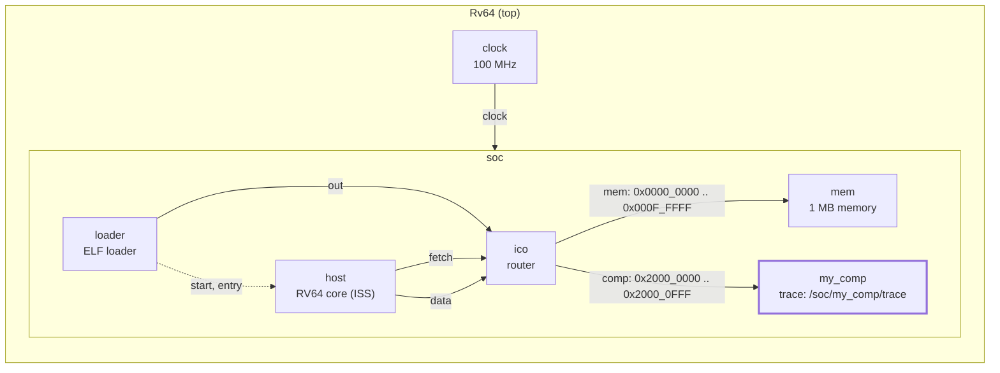
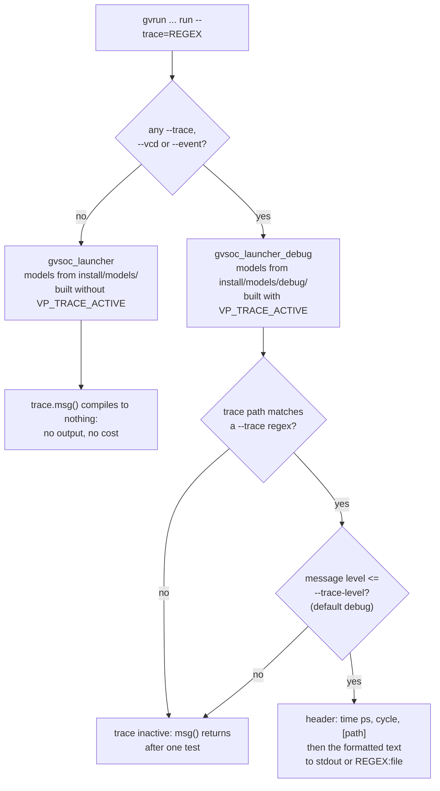

# Tutorial 3: system traces

You replace the `printf` of tutorial 1 with a system trace: a named output
of the component that GVSoC prints only when asked, with the time, the cycle
and the component path in front. This is the tool for seeing what a model
does without changing its code.

This is GVSoC developer tutorial 3, written against the pinned source (gvsoc
`93cedc4`). The text in `tutorials.rst` matches `solution/`. The user manual
page `gvsoc/engine/docs/user_manual/system_traces.rst` describes the
command-line options.

Time: about 15 minutes, plus 3 to 4 minutes of build.

## What you need

- The snax-gvsoc container, with the repo mounted at `/work` and
  `GVSOC_WORKDIR=/work/build` (see `docs/notes/NOTES.md`).
- Tutorial 1 done (`docs/tutorials/1_component_from_scratch.md`). Tutorial 3
  starts from tutorial 1's component, not from tutorial 2's.

In every new container:

```
source gvsoc/sourceme.sh
export GVSOC_ROOT=/work/gvsoc
```

## The system

Tutorial 1's system, unchanged. Only the model's C++ changes:



## Step 1: copy the tutorial out of the GVSoC tree

From `/work`:

```
cd tutorials
T=/work/gvsoc/engine/docs/developer_manual/tutorials
cp -r $T/3_how_to_add_system_traces_to_a_component .
cd 3_how_to_add_system_traces_to_a_component
```

`my_system.py`, `my_comp.py` and `main.c` are tutorial 1's. `my_comp.cpp` is
tutorial 1's model with the `printf` removed, and its handler answers a
4-byte read at any offset. `make prepare` copies the finished files from
`solution/`; only `my_comp.cpp` differs.

## Step 2: add the trace to the model

Replace `my_comp.cpp` with the version below. It is `solution/my_comp.cpp`
with comments added; it builds and runs the same.

```cpp
#include <vp/vp.hpp>
#include <vp/itf/io.hpp>

class MyComp : public vp::Component
{

public:
    MyComp(vp::ComponentConf &config);

private:
    static vp::IoReqStatus handle_req(vp::Block *__this, vp::IoReq *req);

    vp::IoSlave input_itf;

    uint32_t value;

    // A system trace: a named output channel of this component. Its lines
    // are only printed when --trace selects its path.
    vp::Trace trace;
};


MyComp::MyComp(vp::ComponentConf &config)
    : vp::Component(config)
{
    this->input_itf.set_req_meth(&MyComp::handle_req);
    this->new_slave_port("input", &this->input_itf);

    this->value = this->get_js_config()->get_child_int("value");

    // Register the trace under the name "trace". Its path becomes the
    // component path plus the name: /soc/my_comp/trace. That path is what
    // --trace matches and what is printed in brackets on each line.
    this->traces.new_trace("trace", &this->trace);
}

vp::IoReqStatus MyComp::handle_req(vp::Block *__this, vp::IoReq *req)
{
    MyComp *_this = (MyComp *)__this;

    // Replaces the printf of tutorial 1. Printed only if the trace is
    // enabled and --trace-level is debug or higher (debug is the default).
    // GVSoC adds the time, the cycle and the path in front of the text.
    _this->trace.msg(vp::TraceLevel::DEBUG, "Received request at offset 0x%lx, size 0x%lx, is_write %d\n",
        req->get_addr(), req->get_size(), req->get_is_write());

    if (!req->get_is_write() && req->get_size() == 4)
    {
        *(uint32_t *)req->get_data() = _this->value;
    }
    return vp::IO_REQ_OK;
}


extern "C" vp::Component *gv_new(vp::ComponentConf &config)
{
    return new MyComp(config);
}
```

Three additions:

| Line | What it does |
|---|---|
| `vp::Trace trace;` | The trace object, a member of the model. One model can have several, for example one per sub-block or per kind of event. |
| `this->traces.new_trace("trace", &this->trace);` | Registers it. `traces` is a member every component inherits. The trace's path becomes the component path plus the name, `/soc/my_comp/trace` (`BlockTrace::new_trace` in `gvsoc/engine/engine/src/trace/trace.cpp`). A third argument sets the trace's default level; it defaults to `vp::TraceLevel::DEBUG`. |
| `_this->trace.msg(vp::TraceLevel::DEBUG, "...", ...)` | Prints a line if the trace is enabled and the level passes. Same format string as `printf`. GVSoC writes the header (time, cycle, path) itself, so the text needs no prefix. `msg("...")` without a level uses the trace's default level. |

The levels, from `vp::TraceLevel` in `vp/trace/block_trace.hpp`: `ERROR`,
`WARNING`, `INFO`, `DEBUG`, `TRACE`. A message is printed when its level is
at or below `--trace-level`, which is `debug` by default. So `DEBUG` messages
show by default and `TRACE` messages only with `--trace-level=trace`.

Besides `msg`, a trace has `warning(...)` (printed in yellow, also only when
enabled) and `fatal(...)` (always printed, then the simulation aborts).
`vp_warning_always(&trace, ...)` prints a warning even when no trace is
enabled; the core uses it for invalid accesses.

## Step 3: build and run without the trace

```
make gvsoc
make all
make run
```

Expected: only the program's line. The model no longer prints anything:

```
Hello, got 0x12345678 from my comp
```

The build took 3 min 8 s on 2 cores (197 files), again a full rebuild
because the tutorial directory changed.

## Step 4: enable the trace

```
make run runner_args="--trace=my_comp"
```

Expected (colour codes and padding removed, port addresses vary):

```
0: -1: [/soc/my_comp/trace] New slave port (name: clock, port: 0x...)
0: -1: [/soc/my_comp/trace] New slave port (name: reset, port: 0x...)
0: -1: [/soc/my_comp/comp] New slave port (name: power_supply, port: 0x...)
0: -1: [/soc/my_comp/comp] New slave port (name: voltage, port: 0x...)
0: -1: [/soc/my_comp/comp] New slave port (name: input, port: 0x...)
0: -1: [/soc/my_comp/comp] Creating final bindings
0: 0: [/soc/my_comp/comp] Reset (active: 1)
0: 0: [/soc/my_comp/comp] Reset (active: 0)
1580000: 158: [/soc/my_comp/trace] Received request at offset 0x0, size 0x4, is_write 0
Hello, got 0x12345678 from my comp
```

The last trace line is ours. The others come from the base class, which has
its own traces (see [How it works](#how-it-works)). The columns: time in
picoseconds, cycle of the component's clock (`-1` during start-up, before
the reset),
the trace path, then the text.

## Step 5: filter, combine and redirect

```
make run runner_args="--trace=my_comp --trace=insn" 2>&1 | grep -B1 -A1 "Received request"
```

Expected: our line between the two instructions of tutorial 1, all at the
load's cycle:

```
1570000: 157: [/soc/host/insn] main:6  M 0000000000002f28 lui   a5, 0x20000000  a5=0000000020000000
1580000: 158: [/soc/my_comp/trace] Received request at offset 0x0, size 0x4, is_write 0
1580000: 158: [/soc/host/insn] main:6  M 0000000000002f2c c.lw  a1, 0(a5)  a1=0000000012345678 ...
```

`--trace` can be given several times; each value is a regular expression
matched against the trace paths. `--trace=.*` enables everything, which is
a way to discover paths before narrowing down.

```
make run runner_args="--trace=my_comp --trace-level=info"
```

Expected: only `Hello, ...`. Our message is `DEBUG`, above `info`, so it is
filtered out, and so are the base-class lines.

```
make run runner_args="--trace=my_comp:t3.log"
cat /work/build/work/t3.log
```

Expected: nothing on the console but `Hello, ...`; the trace lines are in
`t3.log`. A relative file name goes to the work directory
(`/work/build/work`), not the current directory. The file keeps the colour
codes.

## How it works

**Traces cost nothing in a normal run, because they are compiled out.** Each
model is built four times. Only the `debug` and `profile` variants define
`VP_TRACE_ACTIVE` (`gvsoc/engine/cmake/vp_model.cmake`); in the default
variant `msg()` is an empty function. `gvrun` picks the variant at start-up
(`gen_config` in `gvsoc/engine/python/gvsoc/runner_gvrun2.py`):



So any `--trace`, even one that matches nothing, switches the whole
simulation to the debug launcher and the debug libraries in
`build/install/models/debug/`. This has a cost of its own. Measured on this
system with a loop of 20 million iterations (about 10 instructions each),
2 cores:

| Run | Wall time |
|---|---|
| `make run` | 4.2 s |
| `make run runner_args=--trace=zzz` (matches nothing) | 14.2 s |

That is about 3.5 times slower, before a single line is printed. Profiling
and design-space runs should use no `--trace`; traces are for looking at one
run.

**The path.** Every component already has two traces from its base classes:
`vp::Block` registers one named `trace` and `vp::Component` registers the
same object again as `comp` (`gvsoc/engine/engine/src/block.cpp` and
`component.cpp`). That is why the port and reset lines in step 4 are printed
under `/soc/my_comp/trace` and `/soc/my_comp/comp`. The tutorial names its
own trace `trace` as well, so it shares the path `/soc/my_comp/trace` with
the base class's first lines: `--trace=my_comp/trace` still prints the
`clock` and `reset` port lines. A distinct name (`req`, `fsm`, `dma`) gives a
path of its own. The base trace is also usable directly:
`this->get_trace()->msg(...)`.

**When a message is printed.** In the debug build, `msg(level, ...)` first
checks that the trace is active (its path matched a `--trace` expression at
start-up) and that the global level allows it; only then is the text
formatted. Both checks are a few instructions, so an inactive trace is cheap
even in the debug build.

## SNAX-MODEL counterparts

| GVSoC | SNAX-MODEL |
|---|---|
| A trace path, `/soc/my_comp/trace` | An event source name in the run viewer |
| `--trace=REGEX` | Choosing which sources to record |
| `--trace=REGEX:file` | The trace file of a run directory |
| `--trace-level` | No direct counterpart |

GVSoC's text traces are lines for humans, with no structure beyond the
header. Events and VCD (tutorial 4) are the structured form.

## Things that can go wrong

- **No trace output at all:** `--trace` was not given, or its expression
  does not match the path. Try `--trace=.*` and look for the path.
- **The trace line is missing but `--trace` matches:** the message level is
  above `--trace-level` (for example a `TRACE` message with the default
  `debug` level).
- **A run with `--trace` is much slower:** expected; it uses the debug
  build. See [How it works](#how-it-works).
- **The trace file is not where you expected:** a relative name is created
  in the work directory, `/work/build/work`.
- **Your trace shows unrelated port lines:** it shares its name with the
  base-class trace `trace`; give it another name.
- **The build takes minutes:** expected after switching tutorials.

## Files

| Path | What |
|---|---|
| `tutorials/3_how_to_add_system_traces_to_a_component/my_comp.cpp` | The model with the trace |
| `tutorials/3_how_to_add_system_traces_to_a_component/my_comp.py` | Unchanged from tutorial 1 |
| `tutorials/3_how_to_add_system_traces_to_a_component/my_system.py` | Unchanged from tutorial 1 |
| `tutorials/3_how_to_add_system_traces_to_a_component/testset.cfg` | GVSoC's own regression test for this tutorial (`gvtest`); it runs with `--trace=my_comp` |
| `build/install/models/debug/gen_my_comp_cpp_<hash>.so` | The variant loaded when tracing |
| `build/work/t3.log` | The trace file from step 5 |

`build/test/test`, `build/work/` and the `my_system` build are shared with
the other tutorials and overwritten by this one.

