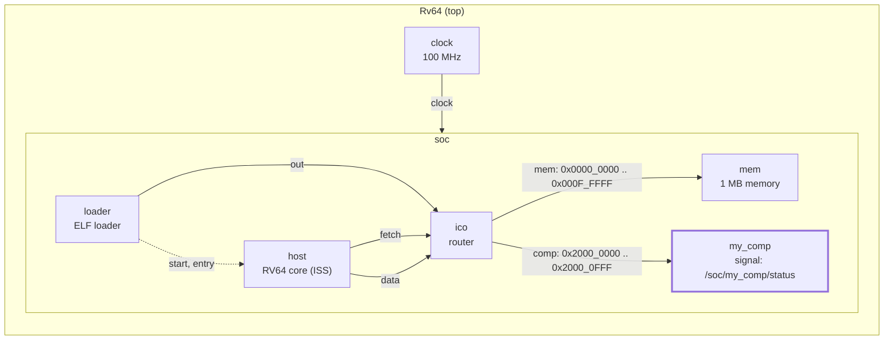
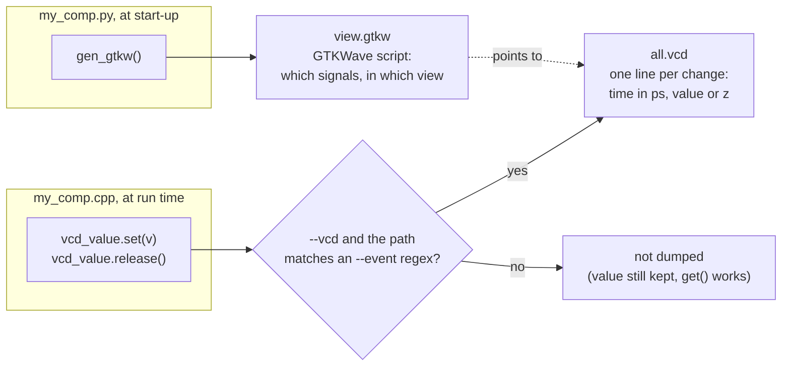

# Tutorial 4: VCD traces

You add a `vp::Signal` to the component: a value that GVSoC writes to a VCD
file every time it changes, so it can be viewed as a waveform in GTKWave next
to the core's own signals. Where a system trace (tutorial 3) is a line of
text, a signal is a value over time.

This is GVSoC developer tutorial 4, written against the pinned source (gvsoc
`93cedc4`). The text in `tutorials.rst` matches `solution/`.

Time: about 20 minutes, plus 3 minutes of build. GTKWave is not in the
container; copy the files to your own machine to view them.

## What you need

- The snax-gvsoc container, with the repo mounted at `/work` and
  `GVSOC_WORKDIR=/work/build` (see `docs/notes/NOTES.md`).
- Tutorial 3 done (`docs/tutorials/3_system_traces.md`). Tutorial 4 starts
  from tutorial 3's component.
- GTKWave on your own machine.

In every new container:

```
source gvsoc/sourceme.sh
export GVSOC_ROOT=/work/gvsoc
```

## The system

Tutorial 1's system, unchanged. The component gets a 32-bit signal:



## Step 1: copy the tutorial out of the GVSoC tree

From `/work`:

```
cd tutorials
T=/work/gvsoc/engine/docs/developer_manual/tutorials
cp -r $T/4_how_to_add_vcd_traces_to_a_component .
cd 4_how_to_add_vcd_traces_to_a_component
```

The starting `my_comp.cpp` is tutorial 3's model, with a write branch added
that reads the stored value and does nothing with it yet. `main.c` is new: it
reads `0x20000000` once, as before, then writes 0 to 19 to it in a loop:

```c
    for (int i=0; i<20; i++)
    {
        *(volatile uint32_t *)0x20000000 = i;
    }
```

`solution/` holds only `my_comp.cpp` and `my_comp.py`; `make prepare`
copies those two.

## Step 2: add the signal to the model

Replace `my_comp.cpp` with the version below, `solution/my_comp.cpp` with
comments added:

```cpp
#include <vp/vp.hpp>
// signal.hpp: vp::Signal<T>, a value that is dumped to VCD on every change.
#include <vp/signal.hpp>
#include <vp/itf/io.hpp>

class MyComp : public vp::Component
{

public:
    MyComp(vp::ComponentConf &config);

private:
    static vp::IoReqStatus handle_req(vp::Block *__this, vp::IoReq *req);

    vp::IoSlave input_itf;

    uint32_t value;

    vp::Trace trace;
    // A VCD signal. T (uint32_t) stores the value and must be at least as
    // wide as the signal. The signal also keeps its last value (get()).
    vp::Signal<uint32_t> vcd_value;
};


// A signal has no default constructor: it is built in the initializer list
// with its parent block, its name and its width in bits. The name gives the
// VCD path /soc/my_comp/status, which --event matches.
MyComp::MyComp(vp::ComponentConf &config)
    : vp::Component(config), vcd_value(*this, "status", 32)
{
    this->input_itf.set_req_meth(&MyComp::handle_req);
    this->new_slave_port("input", &this->input_itf);

    this->value = this->get_js_config()->get_child_int("value");

    this->traces.new_trace("trace", &this->trace);
}

vp::IoReqStatus MyComp::handle_req(vp::Block *__this, vp::IoReq *req)
{
    MyComp *_this = (MyComp *)__this;

    _this->trace.msg(vp::TraceLevel::DEBUG, "Received request at offset 0x%lx, size 0x%lx, is_write %d\n",
        req->get_addr(), req->get_size(), req->get_is_write());

    if (req->get_size() == 4)
    {
        if (!req->get_is_write())
        {
            *(uint32_t *)req->get_data() = _this->value;
        }
        else
        {
            // For a store, get_data() points to the value the core writes.
            uint32_t value = *(uint32_t *)req->get_data();
            if (value == 5)
            {
                // Show the signal as high impedance (z) from now on, e.g. to
                // mark an idle period.
                _this->vcd_value.release();
            }
            else
            {
                // New value, dumped at the current time.
                _this->vcd_value.set(value);
            }
        }
    }

    return vp::IO_REQ_OK;
}


extern "C" vp::Component *gv_new(vp::ComponentConf &config)
{
    return new MyComp(config);
}
```

| Line | What it does |
|---|---|
| `#include <vp/signal.hpp>` | The signal class, `vp::Signal<T>` (`gvsoc/engine/engine/include/vp/signal.hpp`). |
| `vp::Signal<uint32_t> vcd_value;` | The signal. `T` stores the value; it must be at least as wide as the signal. |
| `vcd_value(*this, "status", 32)` | Built in the constructor's initializer list, because a signal has no default constructor: parent block, name, width in bits. Its path is `/soc/my_comp/status`. Further arguments set the reset behaviour: a reset value (default 0), or `ResetKind::HighZ` to start in `z`. |
| `uint32_t value = *(uint32_t *)req->get_data();` | For a store, `get_data()` points to the data the core writes. |
| `_this->vcd_value.set(value);` | Stores the value and dumps a change at the current time. |
| `_this->vcd_value.release();` | Dumps the signal as high impedance (`z`), for example to show an idle period. |

Other methods worth knowing: `get()` returns the current value, so a signal
can also be model state; `set_and_release(v)` shows `v` for one cycle and
then `z`, a pulse (the core uses it for its `lsu/addr` signal); `inc(n)` and
`dec(n)` change it by `n`. `set` and `release` also take a cycle or time
delay as extra arguments.

## Step 3: put the signal in the GTKWave view

Replace `my_comp.py` with:

```python
import gvsoc.systree

class MyComp(gvsoc.systree.Component):
    def __init__(self, parent: gvsoc.systree.Component, name: str, value: int):

        super().__init__(parent, name)

        self.add_sources(['my_comp.cpp'])

        self.add_properties({
            "value": value
        })

    def i_INPUT(self) -> gvsoc.systree.SlaveItf:
        return gvsoc.systree.SlaveItf(self, 'input', signature='io')


    # Called when gvrun writes the GTKWave script (view.gtkw). It puts the
    # status signal in the "overview" view, so it shows up without picking it
    # by hand. It does not decide what is dumped: that is --event.
    def gen_gtkw(self, tree, comp_traces):

        if tree.get_view() == 'overview':
            tree.add_trace(self, self.name, vcd_signal='status[31:0]', tag='overview')
```

`gen_gtkw` is a hook that `gvrun` calls when it writes the GTKWave script.
It only adds the signal to the script's `overview` group. It does not
decide what is dumped; that is `--event` in step 5.

## Step 4: build and run without VCD

```
make gvsoc
make all
make run
```

Expected: `Hello, got 0x12345678 from my comp`, as before. The build took
3 min 2 s on 2 cores (196 files).

## Step 5: run with VCD

```
make run runner_args="--vcd --event=my_comp"
```

Expected:

```
A Gtkwave script has been generated and can be opened with the following command:
gtkwave /work/build/work/view.gtkw

Hello, got 0x12345678 from my comp
```

and two new files in `/work/build/work`: `all.vcd`, the waveforms, and
`view.gtkw`, the GTKWave script. The tutorial uses `--event=.*`, which dumps
every signal of the system; `--event=my_comp` keeps it to ours. On the check
machine:

| Options | `all.vcd` size | Signals |
|---|---|---|
| `--vcd` | 24 kB | 4 (clock period, core state and irq); `status` is missing |
| `--vcd --event=my_comp` | 24 kB | 5, with `status` |
| `--vcd --event=.*` | 772 kB | 88 |

So `--vcd` alone dumps almost nothing: a signal is only written when its
path matches an `--event` expression.

## Step 6: look at the waveform

Copy `all.vcd` and `view.gtkw` from `build/work/` to your machine, then:

```
gtkwave view.gtkw
```

`view.gtkw` names the VCD with its absolute path in the container
(`[dumpfile] "/work/build/work/all.vcd"`, first line). If GTKWave cannot find
it, edit that line or open `all.vcd` directly and add
`soc` / `my_comp` / `status[31:0]` from the signal tree.

Expected: `status` under `soc.my_comp` in the overview, starting at time
15.13 us (cycle 1513), stepping 0, 1, 2, 3, 4, then `z`, then 6 to 19, one
step every 5 cycles. Read from the VCD file on the check machine (time in
ps):

| Time | Value |
|---|---|
| 15130000 | 0x0 |
| 15180000 | 0x1 |
| ... | ... |
| 15330000 | 0x4 |
| 15380000 | z |
| 15430000 | 0x6 |
| ... | ... |
| 16080000 | 0x13 |

The same changes are visible as text: every signal also has its own trace at
`TRACE` level,

```
make run runner_args="--trace=my_comp --trace-level=trace" 2>&1 | grep status
```

prints `[/soc/my_comp/status/trace] Setting signal (value: 0x00000000)` and
so on, with `Release register` for the `z`.

## How it works



**From `set()` to the file.** A signal owns an event in GVSoC's event engine.
`set()` stores the value and hands the event a change at the current time;
the event is written to `all.vcd` only when `--vcd` is on and the signal's
path matches an `--event` expression. Like `--trace`, `--vcd` or `--event`
switch the run to the debug build (`gen_config` in `runner_gvrun2.py`), so a
VCD run is slower too.

**Time.** The VCD time scale is 1 ps and times are absolute; the cycle
number is the time divided by the clock period (10000 ps at 100 MHz). The
value changes 5 cycles apart: the loop is three instructions (`c.sw`,
`c.addiw`, `bne`), and the taken `bne` costs 3 cycles (`--trace=insn` shows
the next `c.sw` 3 cycles after it). So the core model does add a branch
penalty; tutorial 0's "one instruction per cycle" holds for straight-line
code.

**The GTKWave script.** At start-up `gvrun` asks every component for its
part of the script through `gen_gtkw`. Without the method, `status` is still
in `all.vcd` but not in the prepared view (checked: with the method removed,
`view.gtkw` no longer names it). The script also groups the core's signals
and uses `soc.host.core_state.txt` to show the core state as text.

**Other formats.** `--event-format=fst` writes FST instead of VCD (option
listed in `gvrun`; not tried here).

## SNAX-MODEL counterparts

| GVSoC | SNAX-MODEL |
|---|---|
| `vp::Signal` | A state value plotted over time in the run viewer |
| `--event=REGEX` | Choosing which values to record |
| `all.vcd` | The per-run trace file; VCD is a standard format that a Python reader (`pyvcd`, already in the container) can parse |
| `release()` / `z` | An idle marker |

## Things that can go wrong

- **`status` is not in the VCD:** `--event` is missing or does not match.
  `--vcd` alone does not dump component signals.
- **GTKWave opens but finds no file:** the `[dumpfile]` path in `view.gtkw`
  is the container path; fix it or open `all.vcd` directly.
- **The VCD is large:** `--event=.*` dumps every signal of the system; 772 kB
  for 1500 cycles here. Narrow the expression for longer runs.
- **Old files in `build/work/`:** `gvrun` does not clean the work directory,
  so `all.vcd`, `stats.txt` or trace files from earlier runs stay there.
- **The build takes minutes:** expected after switching tutorials.

## Files

| Path | What |
|---|---|
| `tutorials/4_how_to_add_vcd_traces_to_a_component/my_comp.cpp` | The model with the signal |
| `tutorials/4_how_to_add_vcd_traces_to_a_component/my_comp.py` | The generator, with `gen_gtkw` |
| `tutorials/4_how_to_add_vcd_traces_to_a_component/main.c` | Reads once, then writes 0 to 19 |
| `tutorials/4_how_to_add_vcd_traces_to_a_component/testset.cfg` | GVSoC's own regression test for this tutorial (`gvtest`); not used here |
| `build/work/all.vcd` | The waveforms |
| `build/work/view.gtkw` | The GTKWave script |

`build/test/test`, `build/work/` and the `my_system` build are shared with
the other tutorials and overwritten by this one.


