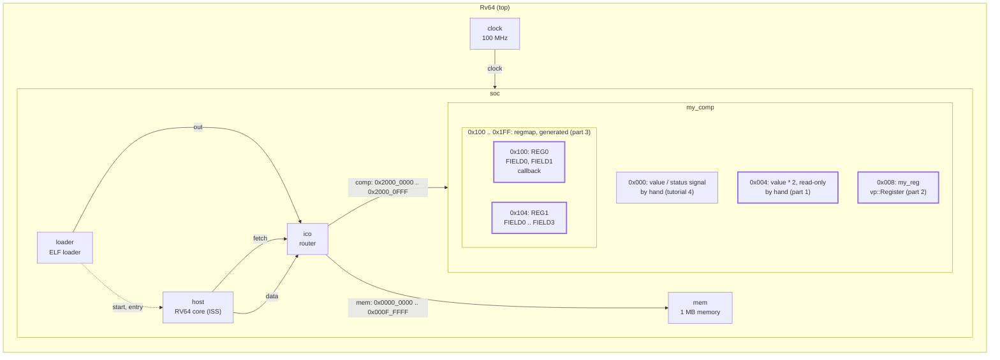
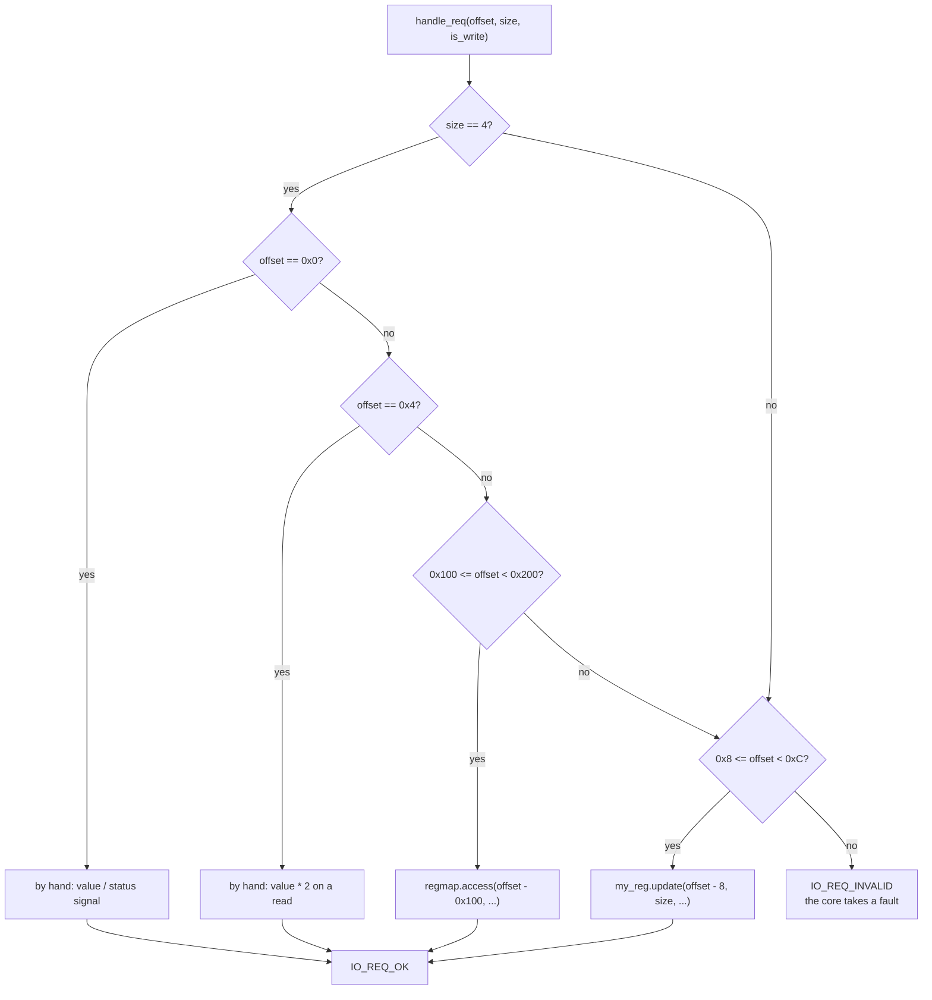
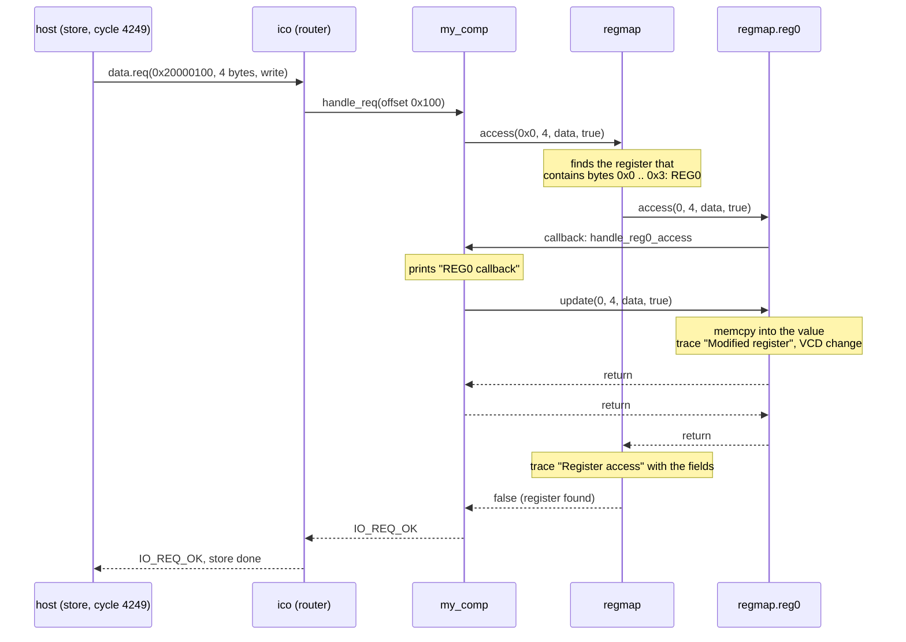

# Tutorial 5: register map

You give the component registers, three ways: decoded by hand in the request
handler, as a `vp::Register` object, and as a whole register map generated
by `regmap-gen` from a Markdown table. The third is how the stock Snitch
cluster peripheral is built, and the nearest thing GVSoC has to a register
window of an accelerator.

This is GVSoC developer tutorial 5, written against the pinned source (gvsoc
`93cedc4`). The code in `tutorials.rst` matches `solution/`, but its trace
paths and cycle numbers are out of date, and the `make regmap` rule does not
work from a copy outside the GVSoC tree (step 5).

Time: about 45 minutes, plus 3 to 4 minutes of build.

## What you need

- The snax-gvsoc container, with the repo mounted at `/work` and
  `GVSOC_WORKDIR=/work/build` (see `docs/notes/NOTES.md`).
- Tutorial 4 done (`docs/tutorials/4_vcd_traces.md`). Tutorial 5 starts from
  tutorial 4's component.

In every new container:

```
source gvsoc/sourceme.sh
export GVSOC_ROOT=/work/gvsoc
```

## The system

Tutorial 1's system, unchanged. The component's 4 kB window gets four
registers and a generated map:



## Step 1: copy the tutorial out of the GVSoC tree

From `/work`:

```
cd tutorials
T=/work/gvsoc/engine/docs/developer_manual/tutorials
cp -r $T/5_how_to_add_a_register_map_in_a_component .
cd 5_how_to_add_a_register_map_in_a_component
```

The starting `my_comp.cpp` is tutorial 4's model with two changes: it only
serves offset 0, and it returns `vp::IO_REQ_INVALID` for everything else, so
a wrong access now traps. `my_comp.py` has no `gen_gtkw` any more. `main.c`
reads `0x20000000` once. `solution/` holds `main.c`, `my_comp.cpp` and
`regmap.md`.

Do not run `make prepare` here. It copies `solution/` over the working
files, and that `my_comp.cpp` includes the generated headers, so
`make gvsoc` fails until step 5 is done.

## Step 2: build and run the starting point

```
make gvsoc
make all
make run
```

Expected: `Hello, got 0x12345678 from my comp`. This is the full rebuild
that comes with a new tutorial directory; the later builds in this page take
about 6 s.

## Step 3 (part 1): a second register by hand

The handler gets the offset inside the component's window
(`req->get_addr()`, the router removed the base). A register by hand is one
more branch on that offset. In `my_comp.cpp`, in `handle_req`, add the
`else if` after the block for offset 0:

```cpp
            return vp::IO_REQ_OK;
        }
        else if (req->get_addr() == 4)
        {
            // Register at 0x4, read-only: twice the value from the generator.
            // A write is accepted and ignored.
            if (!req->get_is_write())
            {
                *(uint32_t *)req->get_data() = _this->value * 2;
            }
            return vp::IO_REQ_OK;
        }
    }

    return vp::IO_REQ_INVALID;
```

In `main.c`, add a second read before `return 0;`:

```c
    printf("Hello, got 0x%x from my comp\n", *(uint32_t *)0x20000004);
```

Build and run:

```
make gvsoc all run
```

Expected:

```
Hello, got 0x12345678 from my comp
Hello, got 0x2468acf0 from my comp
```

This only works for aligned 4-byte accesses, because the branch sits inside
`if (req->get_size() == 4)`. Serving 1- and 2-byte accesses by hand means
copying part of the value with `memcpy`; part 2 does that for you.

## Step 4 (part 2): a `vp::Register`

A `vp::Register<T>` holds the value, serves partial accesses, and has its own
trace and VCD signal. Three additions to `my_comp.cpp`.

The member, after `vcd_value`:

```cpp
    vp::Register<uint32_t> my_reg;
```

Its construction, in the initializer list:

```cpp
MyComp::MyComp(vp::ComponentConf &config)
    : vp::Component(config), vcd_value(*this, "status", 32),
    my_reg(*this, "my_reg", 32)
{
```

The branch in `handle_req`, just before the final `return
vp::IO_REQ_INVALID;` and outside the `size == 4` block:

```cpp
    if (req->get_addr() >= 8 && req->get_addr() < 12)
    {
        _this->my_reg.update(req->get_addr() - 8, req->get_size(), req->get_data(),
            req->get_is_write());

        if (req->get_is_write() && _this->my_reg.get() == 0x11227744)
        {
            printf("Hit value\n");
        }

        return vp::IO_REQ_OK;
    }
```

In `main.c`, before `return 0;`:

```c
    *(uint32_t *)0x20000008 = 0x11223344;
    *(uint8_t *)0x20000009 = 0x77;

    printf("Hello, got 0x%x at 0x20000008\n", *(uint32_t *)0x20000008);
```

Build, then run with the register's trace:

```
make gvsoc all
make run runner_args="--trace=my_comp/my_reg --trace-level=trace"
```

Expected:

```
Hello, got 0x12345678 from my comp
Hello, got 0x2468acf0 from my comp
28650000: 2865: [/soc/my_comp/my_reg/trace     ] Modified register (value: 0x11223344)
28670000: 2867: [/soc/my_comp/my_reg/trace     ] Modified register (value: 0x11227744)
Hit value
Hello, got 0x11227744 at 0x20000008
```

The 4-byte store sets the register; the 1-byte store at `0x20000009`
replaces byte 1 only (`0x33` becomes `0x77`). `Modified register` is at
`TRACE` level, so `--trace-level=trace` is needed to see it.

## Step 5 (part 3): describe the map and generate the code

Copy the description:

```
cp solution/regmap.md .
```

`regmap.md` has one table of registers, then one table of fields per
register:

```markdown
# MyComp

## Description

## Registers

| Register Name | Offset | Size | Default     | Description      |
| ---           | ---    | ---  | ---         | ---              |
| REG0          | 0x00   | 32   | 0x00000000  | Register 0       |
| REG1          | 0x04   | 32   | 0x00000000  | Register 1       |

### REG0

#### Fields

| Field Name | Offset | Size  | Default | Description |
| ---        | ---    | ---   | ---     | ---         |
| FIELD0     | 0      | 8     | 0x00    | Field 0     |
| FIELD1     | 8      | 24    | 0x00    | Field 1     |


### REG1

#### Fields

| Field Name | Offset | Size  | Default | Description |
| ---        | ---    | ---   | ---     | ---         |
| FIELD0     | 0      | 8     | 0x00    | Field 0     |
| FIELD1     | 8      | 8     | 0x00    | Field 1     |
| FIELD2     | 16     | 8     | 0x00    | Field 2     |
| FIELD3     | 24     | 8     | 0x00    | Field 3     |
```

The register offsets are relative to the start of the map, not of the
component. Generate the headers:

```
PYTHONPATH=/work/gvsoc/engine/python /work/gvsoc/engine/bin/regmap-gen --input-md regmap.md --header headers/mycomp
ls headers
```

Expected: no output from `regmap-gen`, and 12 files in `headers/`
(`mycomp.h`, `mycomp_accessors.h`, ..., `mycomp_gvsoc.h`,
`mycomp_regfields.h`, ...). The model uses two: `mycomp_regfields.h` (bit
positions and widths as macros) and `mycomp_gvsoc.h` (the C++ classes). The
rest are headers for software running on the simulated chip.

`regmap-gen` is not a separate tool. It is a Python script in the gvsoc
submodule, `gvsoc/engine/bin/regmap-gen`, and its module is in
`gvsoc/engine/python/regmap/`; the `PYTHONPATH` in front lets the script find
the module. Called this way it needs neither the GVSoC build nor
`sourceme.sh`, only the Python packages of the container.

Two other ways, which both depend on more:

- Plain `regmap-gen`, as in the tutorial text. The GVSoC build installs the
  script in `build/install/bin` and the module in `build/install/python`,
  and `sourceme.sh` puts both on the paths. It needs a finished build and a
  sourced `sourceme.sh`; otherwise `bash: regmap-gen: command not found`.
  It worked on the check machine and not in the container on micaseb19.
- The tutorial's `make regmap`. The Makefile looks for the script at
  `../../../../../engine`, which only exists inside the GVSoC tree, so in a
  copy it needs
  `PYTHONPATH=/work/gvsoc/engine/python make regmap GVSOC_ENGINE=/work/gvsoc/engine`.

## Step 6 (part 3): use the generated map in the model

Replace `my_comp.cpp` with the version below. It is `solution/my_comp.cpp`
with comments added, and the initializer list in declaration order:

```cpp
#include <vp/vp.hpp>
#include <vp/signal.hpp>
#include <vp/itf/io.hpp>
// Generated by regmap-gen from regmap.md. regfields.h has the bit positions
// and widths as macros; gvsoc.h has the C++ classes and needs the macros, so
// the order of these two lines matters.
#include "headers/mycomp_regfields.h"
#include "headers/mycomp_gvsoc.h"

class MyComp : public vp::Component
{

public:
    MyComp(vp::ComponentConf &config);

private:
    static vp::IoReqStatus handle_req(vp::Block *__this, vp::IoReq *req);
    // Called on every access to REG0, read or write.
    void handle_reg0_access(uint64_t reg_offset, int size, uint8_t *value, bool is_write);

    vp::IoSlave input_itf;

    uint32_t value;

    vp::Trace trace;
    vp::Signal<uint32_t> vcd_value;

    // Part 2: one register object. It stores the value, handles partial
    // (byte) accesses, and has its own trace and VCD signal.
    vp::Register<uint32_t> my_reg;

    // Part 3: the generated register map, a vp::Block holding REG0 and REG1.
    // The class name is vp_regmap_<name>, with <name> from regmap-gen --name
    // (default "regmap").
    vp_regmap_regmap regmap;
};


// Like a signal, a register and a regmap have no default constructor: parent
// block, name, and for the register its width in bits. The names give the
// paths /soc/my_comp/my_reg and /soc/my_comp/regmap/reg0, .../reg1.
MyComp::MyComp(vp::ComponentConf &config)
    : vp::Component(config), vcd_value(*this, "status", 32),
    my_reg(*this, "my_reg", 32), regmap(*this, "regmap")
{
    this->input_itf.set_req_meth(&MyComp::handle_req);
    this->new_slave_port("input", &this->input_itf);

    this->value = this->get_js_config()->get_child_int("value");

    this->traces.new_trace("trace", &this->trace);

    // Gives the regmap the trace it reports an unknown offset on.
    this->regmap.build(this, &this->trace);

    // Replace the default handling of REG0 by our method. The last argument
    // (true) also calls it when the register is reset.
    this->regmap.reg0.register_callback(std::bind(
        &MyComp::handle_reg0_access, this, std::placeholders::_1, std::placeholders::_2,
        std::placeholders::_3, std::placeholders::_4), true);
}

void MyComp::handle_reg0_access(uint64_t reg_offset, int size, uint8_t *value, bool is_write)
{
    printf("REG0 callback\n");

    // The callback replaces the default read or write, so it has to do it
    // itself. Without this line REG0 is never written and a read returns
    // nothing.
    this->regmap.reg0.update(reg_offset, size, value, is_write);
}


vp::IoReqStatus MyComp::handle_req(vp::Block *__this, vp::IoReq *req)
{
    MyComp *_this = (MyComp *)__this;

    _this->trace.msg(vp::TraceLevel::DEBUG, "Received request at offset 0x%lx, size 0x%lx, is_write %d\n",
        req->get_addr(), req->get_size(), req->get_is_write());

    if (req->get_size() == 4)
    {
        if (req->get_addr() == 0)
        {
            // Register at 0x0, by hand: the value from the generator on a
            // read, the VCD signal on a write (tutorial 4).
            if (!req->get_is_write())
            {
                *(uint32_t *)req->get_data() = _this->value;
            }
            else
            {
                uint32_t value = *(uint32_t *)req->get_data();
                if (value == 5)
                {
                    _this->vcd_value.release();
                }
                else
                {
                    _this->vcd_value.set(value);
                }
            }
            return vp::IO_REQ_OK;
        }
        else if (req->get_addr() == 4)
        {
            // Part 1. Register at 0x4, by hand, read-only: twice the value.
            // A write is accepted and ignored.
            if (!req->get_is_write())
            {
                *(uint32_t *)req->get_data() = _this->value * 2;
            }
            return vp::IO_REQ_OK;
        }
        else if (req->get_addr() >= 0x100 && req->get_addr() < 0x200)
        {
            // Part 3. Offsets 0x100 to 0x1ff go to the generated regmap,
            // which finds the register from the offset inside the map.
            _this->regmap.access(req->get_addr() - 0x100, req->get_size(), req->get_data(),
                req->get_is_write());
            return vp::IO_REQ_OK;
        }
    }

    // Part 2. Register at 0x8, outside the size check so that 1- and 2-byte
    // accesses reach it too. update() copies `size` bytes at the given byte
    // offset, from the request on a write and into it on a read.
    if (req->get_addr() >= 8 && req->get_addr() < 12)
    {
        _this->my_reg.update(req->get_addr() - 8, req->get_size(), req->get_data(),
            req->get_is_write());

        // React to the full value after the update.
        if (req->get_is_write() && _this->my_reg.get() == 0x11227744)
        {
            printf("Hit value\n");
        }

        return vp::IO_REQ_OK;
    }

    // Anything else is refused, and the core takes a fault.
    return vp::IO_REQ_INVALID;
}


extern "C" vp::Component *gv_new(vp::ComponentConf &config)
{
    return new MyComp(config);
}
```

New lines, parts 2 and 3:

| Line | What it does |
|---|---|
| `vp::Register<uint32_t> my_reg;` | A register (`gvsoc/engine/engine/include/vp/register.hpp`). `T` stores the value. |
| `my_reg(*this, "my_reg", 32)` | Parent block, name, width in bits. Two more optional arguments: `do_reset` (default `false`: the register keeps its value over a reset) and the reset value. |
| `my_reg.update(offset, size, data, is_write)` | Copies `size` bytes at byte `offset` of the register: from `data` on a write, into `data` on a read. No bounds check (see "Beyond the tutorial"). |
| `my_reg.get()` | The full value. `set(v)`, `inc`, `dec`, `=`, `\|=`, `&=` and `set_field` / `get_field` also exist. |
| `#include "headers/mycomp_regfields.h"`, `..._gvsoc.h` | The generated macros and classes. The classes are inside `#ifdef __GVSOC__`, which the model build defines. |
| `vp_regmap_regmap regmap;` | The generated map: a `vp::regmap` (a `vp::Block`) with one member per register, `reg0` and `reg1`, each a `vp::Register<uint32_t>` with accessors per field (`field0_get()`, `field0_set(v)`). |
| `regmap(*this, "regmap")` | Parent block and name. The registers get the paths `/soc/my_comp/regmap/reg0` and `.../reg1`. |
| `regmap.build(this, &this->trace)` | Stores the component and the trace on which an access to an unknown offset is reported. |
| `regmap.reg0.register_callback(fn, true)` | `fn` is called on every access to REG0 instead of the default read or write. `true`: also when the register is reset. |
| `regmap.reg0.update(...)` in the callback | The read or write itself, which the callback now has to do. |
| `regmap.access(offset, size, data, is_write)` | Finds the register that contains `offset .. offset+size` and calls its callback, or its `update` when it has none. Returns `true` when no register matches. |

Copy the program and build:

```
cp solution/main.c .
make gvsoc all run
```

`solution/main.c` is the `main.c` from step 4 plus two stores:

```c
    *(volatile uint32_t *)0x20000100 = 0x12345678;
    *(volatile uint32_t *)0x20000104 = 0x12345678;
```

Expected:

```
REG0 callback
Hello, got 0x12345678 from my comp
Hello, got 0x2468acf0 from my comp
Hit value
Hello, got 0x11227744 at 0x20000008
REG0 callback
```

The first `REG0 callback` is the reset at time 0, the last one the store to
`0x20000100`. REG1 has no callback, so its store prints nothing.

## Step 7: see the register accesses

```
make run runner_args="--trace=my_comp/regmap --trace-level=trace"
```

Expected, without the `Hello` lines:

```
0: 0: [/soc/my_comp/regmap/trace     ] Reset (active: 1)
0: 0: [/soc/my_comp/regmap/reg0/trace] Resetting register
REG0 callback
0: 0: [/soc/my_comp/regmap/reg0/trace] Modified register (value: 0x00000000)
0: 0: [/soc/my_comp/regmap/reg1/trace] Resetting register
0: 0: [/soc/my_comp/regmap/reg1/trace] Modified register (value: 0x00000000)
0: 0: [/soc/my_comp/regmap/trace     ] Reset (active: 0)
REG0 callback
42490000: 4249: [/soc/my_comp/regmap/reg0/trace] Modified register (value: 0x12345678)
42490000: 4249: [/soc/my_comp/regmap/reg0/trace] Register access (name: REG0, offset: 0x0, size: 0x4, is_write: 0x1, value: { FIELD0=0x78, FIELD1=0x123456 })
42500000: 4250: [/soc/my_comp/regmap/reg1/trace] Modified register (value: 0x12345678)
42500000: 4250: [/soc/my_comp/regmap/reg1/trace] Register access (name: REG1, offset: 0x4, size: 0x4, is_write: 0x1, value: { FIELD0=0x78, FIELD1=0x56, FIELD2=0x34, FIELD3=0x12 })
```

`Register access`, with the value split into fields, is at `DEBUG` level;
`Modified register` and `Resetting register` are at `TRACE` level. The
tutorial text shows the paths without `regmap/`; the pinned source puts the
registers under the regmap block.

The registers are also VCD signals: `--vcd --event=my_comp` puts `my_reg`,
`regmap/reg0` and `regmap/reg1` (32 bits each) in `all.vcd` next to
`status`.

## How it works

The decision path of `handle_req`:



A store to REG0, all inside the core's store instruction at cycle 4249:



**A register is a value plus bookkeeping.** `vp::Register<T>` is a `T` with a
name. Its constructor registers a trace (`<name>/trace`) and a VCD event
(`<name>`) with the parent block, and adds the register to the block's list
so that the block's reset reaches it. `update` is a `memcpy` of `size` bytes
at a byte offset, which is why a 1-byte store just works. Like everything so
far, an access takes no time: the request, the callback and the trace lines
all carry the same cycle.

**The generated map.** `mycomp_gvsoc.h` defines one class per register,
derived from `vp::Register<uint32_t>`, whose constructor fills in the
register's name, offset, width, reset value and list of fields, and one
class `vp_regmap_regmap`, derived from `vp::regmap`, that owns them.
`vp::regmap` is a `vp::Block` (tutorial 3's sub-unit), which is where the
`regmap/` in the paths comes from. `regmap.access` walks the list of
registers and picks the one that contains the whole access
(`gvsoc/engine/engine/src/register.cpp`).

**Callbacks.** A register has at most one callback. When it is set,
`access` calls it and does nothing else, for reads as well as writes; the
callback decides whether the value is stored. This is the hook for side
effects: the stock Snitch cluster peripheral
(`gvsoc/pulp/pulp/snitch/snitch_cluster/cluster_registers.cpp`) uses one on
`cl_clint_set` to raise the cores' interrupt wires.

**Reset.** Generated registers are built with `do_reset` on and the
`Default` of the register table as reset value. At reset the block writes
that value into each register, through the callback when it was registered
with `true`; this is the first `REG0 callback`. `my_reg` was built without
`do_reset` and is left alone.

**regmap-gen** (`gvsoc/engine/bin/regmap-gen`, Python in
`gvsoc/engine/python/regmap/`) reads Markdown, HJSON, JSON or XLS and writes
C headers, RST, JSON or IP-XACT. The stock cluster peripheral does not call
the script: its generator has a `gen(self, builddir, installdir)` method
that reads the HJSON register file of snitch_cluster and writes the two
headers into the build directory at build time (see below).

Worth a thought: a `busy` flag could be a register the model keeps up to
date, or a value computed in a read callback. Which of the two shows up in
the VCD?

## Beyond the tutorial

Tried on the check machine, on the finished model unless said otherwise.

| Tried | What happens |
|---|---|
| Read `0x20000108` (in the map's range, no register there) | `Accessing invalid register (offset: 0x8, size: 0x4, is_write: 0)` on `/soc/my_comp/trace`, and the run stops with exit code 1: warnings are errors by default (`force_warning` calls `exit(1)`). With `--no-werror` the run goes on, the model still answers `IO_REQ_OK` and the program reads a stale value (`0xb20`). |
| 1-byte store to `0x20000101` | Refused by the `size == 4` check: `IO_REQ_INVALID`, the core faults, `Platform returned an error (exitcode: 1)`, no message naming the address. |
| 4-byte store to `0x20000102` | GCC splits the misaligned access into 2-byte ones; the first (`lhu` at offset `0x102`, size 2) is refused the same way. A request crossing two registers could not be produced from C. |
| 8-byte store and load at `0x20000008` | Accepted. The trace shows `0x11223344`, the 8-byte load returns `0xdeadbeef11223344`: `update` does not compare the size with the register width, so 4 bytes were written past the value. Nothing visible broke here. |
| 2-byte store of `0xbeef` to `0x2000000a` | `my_reg` reads `0xbeef0000`. |
| Callback without the `update` line | A store is lost and a load returns a stale value (`0xb10`). The callback is called for loads too. |
| `register_callback(fn)` without `true` | No callback at reset. |
| A lambda instead of `std::bind` | Works: `[this](uint64_t o, int s, uint8_t *v, bool w) { this->handle_reg0_access(o, s, v, w); }`. |
| Without `regmap.build(...)` | No change in this run. From the source, the call only stores the trace used for the invalid-register warning; without it that warning would abort. The second half is read, not run. |
| `Default` of REG0 set to `0x000000AB` in the register table | REG0 reads `0xab` after reset. A `Default` in a field table (`0x11`) does not change the reset value. |
| `Access Type` column with `R` for REG1's FIELD3 | The header gets `write_mask = 0xffffff`, but a store of `0xffffffff` reads back `0xffffffff`: `vp::Register` does not apply the mask. Read-only has to be done in a callback. |
| `regmap.reg0.field0_get()`, `field1_get()` in the callback | `0x78` and `0x123456` after the store. |
| `regmap-gen --name mycomp` | Classes `vp_mycomp_reg0`, `vp_regmap_mycomp`; macros `MYCOMP_REG0_FIELD0_BIT`. |
| `regmap-gen --header-headers regfields,gvsoc` | Only the two headers the model needs. |
| Edit `regmap.md`, run `regmap-gen`, `make gvsoc` | The four variants of `my_comp.cpp` rebuild, 6 s. `make gvsoc` alone does not regenerate. |
| `headers/` missing | `fatal error: headers/mycomp_regfields.h: No such file or directory`. |

**Generating at build time.** The stock way, tried here with `regmap.md`:
add this method to `MyComp` in `my_comp.py`, and include
`<my_comp_gen/mycomp_regfields.h>` and `<my_comp_gen/mycomp_gvsoc.h>` in the
model.

```python
    # Called by the GVSoC build for every component of the target, before
    # the C++ models are compiled.
    def gen(self, builddir, installdir):
        import os
        import regmap.regmap
        import regmap.regmap_md
        import regmap.regmap_c_header

        md = os.path.join(os.path.dirname(os.path.abspath(__file__)), 'regmap.md')
        rmap = regmap.regmap.Regmap('regmap')
        regmap.regmap_md.import_md(rmap, md)
        regmap.regmap_c_header.dump_to_header(regmap=rmap, name='regmap',
            header_path=f'{builddir}/my_comp_gen/mycomp', headers=['regfields', 'gvsoc'])
```

`make gvsoc` then writes the headers to
`build/build/engine/my_comp_gen/`, and after an edit of `regmap.md` it
regenerates them and rebuilds the model (7 s). No `headers/` directory and
no separate step. The working copy keeps the tutorial's form.

## SNAX-MODEL counterparts

| GVSoC | SNAX-MODEL |
|---|---|
| The component's window on the router, decoded in `handle_req` | The register window of an accelerator |
| `regmap.md` / HJSON and `regmap-gen` | The register list of the accelerator in the platform description |
| `vp::Register` with its trace and VCD signal | A register whose writes are events in the run viewer |
| A callback on a register | What the model does when `start` is written |
| Reset value from the `Default` column | The register's initial value |

## Things that can go wrong

- **`make regmap` fails with `../../../../../engine/bin/regmap-gen: No such
  file or directory`:** the copy is outside the GVSoC tree. Call
  `regmap-gen` directly (step 5).
- **`bash: regmap-gen: command not found`:** the script is not on the
  `PATH`. Call it from the source tree with `PYTHONPATH` set (step 5).
- **`ModuleNotFoundError: No module named 'regmap'`:** the script was called
  by its path without the `PYTHONPATH` in front.
- **`fatal error: headers/mycomp_regfields.h: No such file or directory`:**
  step 5 was skipped or failed, so `headers/` does not exist.
- **A change in `regmap.md` has no effect:** `regmap-gen` was not run again.
- **`'REGMAP_REG0_FIELD0_BIT' was not declared in this scope`:** the two
  includes are in the wrong order; `mycomp_regfields.h` goes first.
- **`vp_regmap_regmap` is unknown:** `regmap-gen` was run with another
  `--name` (not run here; the class is then `vp_regmap_<name>`).
- **The run stops with `Accessing invalid register` and exit code 1:** the
  program touched an offset in `0x100 .. 0x1ff` that has no register.
- **`Platform returned an error (exitcode: 1)` with no other message:** the
  program made an access the model refuses (wrong offset, or a size other
  than 4 outside `0x8 .. 0xb`). `--trace=my_comp` shows the last request.
- **No `Modified register` lines:** they need `--trace-level=trace`.
- **A register written through its callback reads back wrong:** the
  callback does not call `update`.
- **The build takes minutes:** expected once after switching tutorials.

## Files

| Path | What |
|---|---|
| `tutorials/5_how_to_add_a_register_map_in_a_component/my_comp.cpp` | The model with the three kinds of register |
| `tutorials/5_how_to_add_a_register_map_in_a_component/regmap.md` | The register map description |
| `tutorials/5_how_to_add_a_register_map_in_a_component/headers/` | Generated by `regmap-gen`; recreated by step 5 |
| `tutorials/5_how_to_add_a_register_map_in_a_component/main.c` | Reads the two hand-made registers, writes `my_reg`, REG0 and REG1 |
| `tutorials/5_how_to_add_a_register_map_in_a_component/my_comp.py` | The generator, unchanged |
| `tutorials/5_how_to_add_a_register_map_in_a_component/testset.cfg` | GVSoC's own regression test for this tutorial (`gvtest`); not used here |
| `gvsoc/engine/engine/include/vp/register.hpp`, `gvsoc/engine/engine/src/register.cpp` | `vp::Register` and `vp::regmap` |
| `gvsoc/engine/bin/regmap-gen`, `gvsoc/engine/python/regmap/` | The generator script |

`build/test/test`, `build/work/` and the `my_system` build are shared with
the other tutorials and overwritten by this one.

