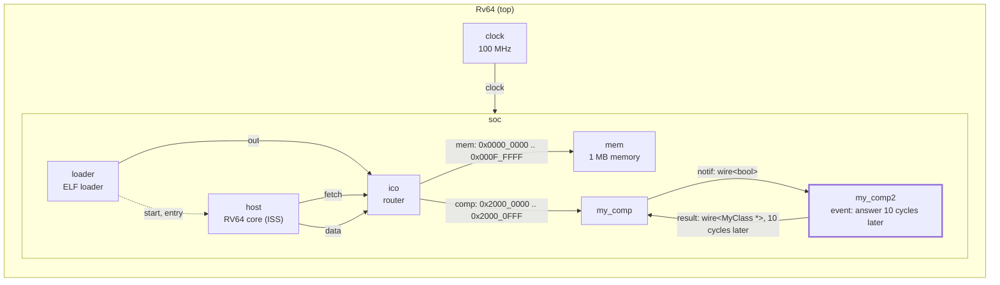
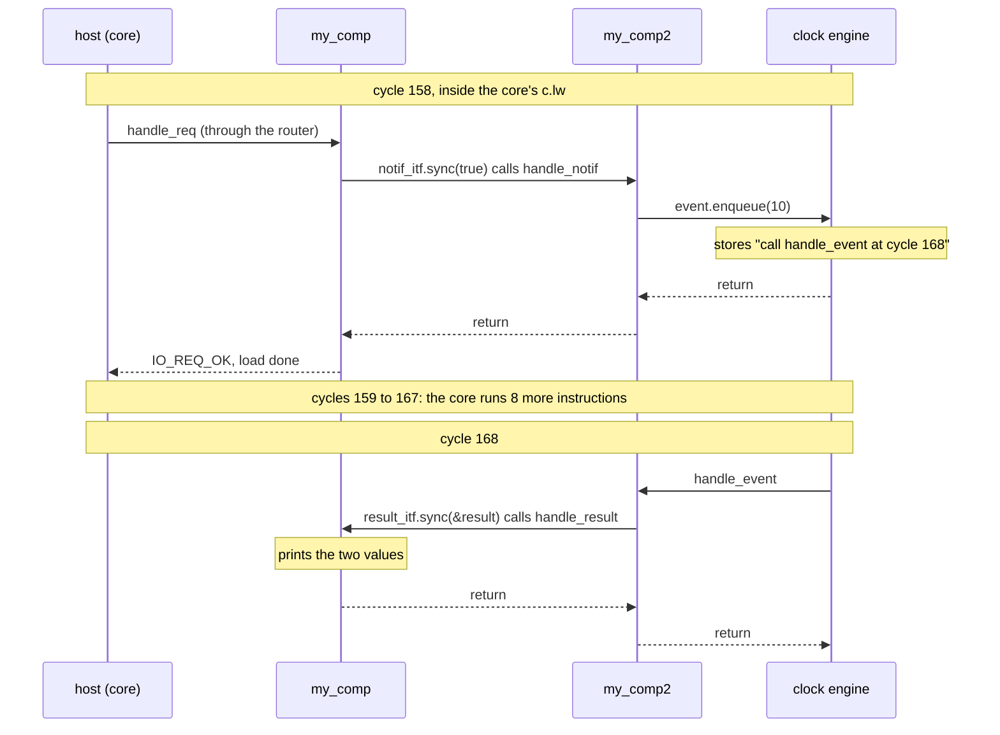

# Tutorial 6: timing

You make the second component answer 10 cycles after it is notified, with a
`vp::ClockEvent`: a function call that the clock engine makes for the model
at a later cycle. Until now everything a model did happened inside the
caller, in zero time. A clock event is how a model gets a duration.

This is GVSoC developer tutorial 6, written against the pinned source (gvsoc
`93cedc4`). The text in `tutorials.rst` guards the enqueue with
`is_enqueued()`; `solution/` does not. Both behave the same at the pin (see
"Beyond the tutorial"). The cycle numbers in the text are out of date.

Time: about 30 minutes, plus 2 to 3 minutes of build.

## What you need

- The snax-gvsoc container, with the repo mounted at `/work` and
  `GVSOC_WORKDIR=/work/build` (see `docs/notes/NOTES.md`).
- Tutorials 2 and 3 done (`docs/tutorials/2_components_communicating.md`,
  `3_system_traces.md`). Tutorial 6 starts from tutorial 2's two components,
  not from tutorial 5's register map.

In every new container:

```
source gvsoc/sourceme.sh
export GVSOC_ROOT=/work/gvsoc
```

## The system

Tutorial 2's system. `my_comp2` gets a clock event between its input and
its output:



## Step 1: copy the tutorial out of the GVSoC tree

From `/work`:

```
cd tutorials
T=/work/gvsoc/engine/docs/developer_manual/tutorials
cp -r $T/6_how_to_add_timing .
cd 6_how_to_add_timing
```

The starting files are tutorial 2's solution, with one change: `my_comp2`
uses a trace in place of `printf`. `my_comp.cpp`, `my_comp.py`,
`my_system.py` and `main.c` are unchanged from tutorial 2. `solution/` holds
only `my_comp2.cpp`.

## Step 2: build and run the starting point

```
make gvsoc
make all
make run
```

Expected:

```
Received request at offset 0x0, size 0x4, is_write 0
Received results 11111111 22222222
Hello, got 0x12345678 from my comp
```

The build took 2 min 33 s on 2 cores (201 files); later builds in this page
take about 4 s. Now with the traces of `my_comp2` and of the core:

```
make run runner_args="--trace=my_comp2/trace --trace=insn --trace-level=debug" 2>&1 | grep -A5 "Received request"
```

Expected (lines shortened):

```
Received request at offset 0x0, size 0x4, is_write 0
1580000: 158: [/soc/my_comp2/trace           ] Received notif
1580000: 158: [/soc/my_comp2/trace           ] Sending result
Received results 11111111 22222222
1580000: 158: [/soc/host/insn                ] main:6    M 0000000000002f2c c.lw    a1, 0(a5)  ...
1590000: 159: [/soc/host/insn                ] main:5    M 0000000000002f2e c.addi  sp, sp, fffffffffffffff0  ...
```

The notification and the result are both in cycle 158, inside the core's
`c.lw`. This is the "before".

## Step 3: add the event to the second model

Replace `my_comp2.cpp` with the version below, `solution/my_comp2.cpp` with
comments added:

```cpp
#include <vp/vp.hpp>
#include <vp/itf/wire.hpp>
#include "my_class.hpp"

class MyComp : public vp::Component
{

public:
    MyComp(vp::ComponentConf &config);

private:
    static void handle_notif(vp::Block *__this, bool value);
    // The function the event runs. Same pattern as a port handler: static,
    // the instance as first argument, then the event itself.
    static void handle_event(vp::Block *__this, vp::ClockEvent *event);
    vp::WireSlave<bool> notif_itf;
    vp::WireMaster<MyClass *> result_itf;

    // One function call that the clock engine makes for us at a later cycle.
    vp::ClockEvent event;
    vp::Trace trace;
};


// An event has no default constructor: it is built in the initializer list
// with the block that owns it (which gives it the clock) and its callback.
MyComp::MyComp(vp::ComponentConf &config)
    : vp::Component(config), event(this, MyComp::handle_event)
{
    this->notif_itf.set_sync_meth(&MyComp::handle_notif);
    this->new_slave_port("notif", &this->notif_itf);

    this->new_master_port("result", &this->result_itf);

    this->traces.new_trace("trace", &this->trace);
}


// Called by the clock engine 10 cycles after the enqueue. This is no longer
// inside the core's load: the core is running other instructions by now.
void MyComp::handle_event(vp::Block *__this, vp::ClockEvent *event)
{
    MyComp *_this = (MyComp *)__this;
    _this->trace.msg(vp::TraceLevel::DEBUG, "Sending result\n");

    MyClass result = { .value0=0x11111111, .value1=0x22222222 };
    _this->result_itf.sync(&result);
}

void MyComp::handle_notif(vp::Block *__this, bool value)
{
    MyComp *_this = (MyComp *)__this;

    _this->trace.msg(vp::TraceLevel::DEBUG, "Received notif\n");

    // Ask for handle_event to be called 10 cycles from now, and return at
    // once. The count is in cycles of this component's clock.
    _this->event.enqueue(10);
}


extern "C" vp::Component *gv_new(vp::ComponentConf &config)
{
    return new MyComp(config);
}
```

| Line | What it does |
|---|---|
| `static void handle_event(vp::Block *__this, vp::ClockEvent *event);` | The event's callback, of type `vp::ClockEventMeth` (`gvsoc/engine/engine/include/vp/clock/clock_event.hpp`). Static, like a port handler; the second argument is the event that fired. |
| `vp::ClockEvent event;` | The event, a member of the model. It needs no include of its own; `vp/vp.hpp` brings it. |
| `event(this, MyComp::handle_event)` | Owner block and callback. The owner gives the event its clock, here the 100 MHz clock that `soc` hands down to all its components. |
| `_this->event.enqueue(10);` | Schedules one call of the callback 10 cycles from now and returns. `enqueue()` without argument means 1 cycle. |
| body of `handle_event` | What used to be in `handle_notif` after the trace: build the result and send it. It now runs when the clock engine reaches the cycle. |

What moved: in the starting file, `handle_notif` sent the result itself. Now
it only schedules, and `handle_event` sends.

## Step 4: build and run

```
make gvsoc all run
```

Expected: the same three lines as in step 2. Without traces the delay is
invisible, because the core does not wait for the result.

## Step 5: see the delay

```
make run runner_args="--trace=my_comp2/trace --trace=insn --trace-level=debug" 2>&1 | grep -A16 "Received request"
```

Expected (lines shortened):

```
Received request at offset 0x0, size 0x4, is_write 0
1580000: 158: [/soc/my_comp2/trace           ] Received notif
1580000: 158: [/soc/host/insn                ] main:6     M 0000000000002f2c c.lw        a1, 0(a5)  ...
1590000: 159: [/soc/host/insn                ] main:5     M 0000000000002f2e c.addi      sp, sp, fffffffffffffff0  ...
1600000: 160: [/soc/host/insn                ] main:6     M 0000000000002f30 addi        a0, 0, 260  ...
1610000: 161: [/soc/host/insn                ] main:5     M 0000000000002f34 c.sdsp      ra, 8(sp)  ...
1620000: 162: [/soc/host/insn                ] main:6     M 0000000000002f36 jal         ra, ffffffffffffffb4  ...
1640000: 164: [/soc/host/insn                ] printf:38  M 0000000000002eea c.addi16sp  sp, sp, ffffffffffffffa0  ...
1650000: 165: [/soc/host/insn                ] printf:42  M 0000000000002eec addi        t1, sp, 28  ...
1660000: 166: [/soc/host/insn                ] printf:43  M 0000000000002ef0 c.lui       t3, 0x1000  ...
1670000: 167: [/soc/host/insn                ] printf:38  M 0000000000002ef2 c.sdsp      a1, 28(sp)  ...
1680000: 168: [/soc/host/insn                ] printf:38  M 0000000000002ef4 c.sdsp      a2, 30(sp)  ...
1680000: 168: [/soc/my_comp2/trace           ] Sending result
Received results 11111111 22222222
1690000: 169: [/soc/host/insn                ] printf:38  M 0000000000002ef6 c.sdsp      a3, 38(sp)  ...
```

`Received notif` is at cycle 158 and `Sending result` at cycle 168, 10
cycles later. In between the core goes on: it finishes the load, returns
from the access and is already inside `printf` when the result arrives.

## How it works



**An event is a callback plus a cycle.** `enqueue(n)` puts the event in a
list of its clock engine, sorted by cycle, with the cycle `now + n`
(`ClockEngine::enqueue` in `gvsoc/engine/engine/src/clock/clock_engine.cpp`).
When the engine reaches that cycle it calls the callback. Nothing in the
model waits or blocks: `handle_notif` returns at once, and the model's state
between the two calls is whatever it kept in its members.

**The core is driven the same way.** The function that executes one
instruction, `Exec::exec_instr` in
`gvsoc/core/models/cpu/iss/src/exec/exec_inorder.cpp`, has the signature of
a clock event callback (read, not run). So the core and `my_comp2` are both
callbacks of the same clock engine, which is why the core keeps running
while the event is pending.

**Cycles belong to a clock.** The count is in cycles of the clock the owner
block received, here 100 MHz, so 10 cycles are 100000 ps in the trace's time
column. `this->clock.get_cycles()` returns the current cycle in a model.

**One event, one pending call.** An event holds a single scheduled
execution. To have several things pending at once a model needs several
events, or one event and its own list of what is due.

**Two ways to use an event.** Enqueue it each time something should happen
later, as here. Or `enable()` it, so the callback runs at every cycle until
`disable()`: the header calls this the fastest way for something that runs
all the time, and it is how a per-cycle pipeline would be written.

Worth a thought: `my_comp2` is asked twice within 10 cycles. With one event
it answers once. What would it need to keep to answer twice, each 10 cycles
after its own request?

## Beyond the tutorial

Tried on the check machine, on a copy of `my_comp2.cpp` with the mode
picked at run time.

| Tried | What happens |
|---|---|
| `enqueue(0)` | The callback runs in the same cycle, 158. |
| `enqueue(1)` | Cycle 159. |
| Two loads back to back, so two notifications at cycles 158 and 159, `enqueue(10)` each time | One callback, at cycle 168, and one result. The second enqueue is ignored: an event that is already pending keeps its cycle when the new one is later. No message. |
| Same, with `enqueue(2)` on the second notification | One callback, at cycle 161. A new cycle that is earlier replaces the pending one. |
| `is_enqueued()` | 0 at the first notification, 1 at the second, 0 again inside the callback. The check in the tutorial text therefore changes nothing here; it documents the intent. |
| `cancel()` on the second notification | No callback and no result. `cancel()` on an event that is not pending is allowed (read). |
| `event->enqueue(2)` from inside the callback, three times | Callbacks at cycles 160, 162 and 164: a periodic event. |
| `enable()` at the notification, `disable()` in the callback after three calls | Callbacks at cycles 159, 160 and 161, one per cycle, starting the cycle after `enable()`. |
| `event.get_args()[0] = ...` before the enqueue, read in the callback | The value arrives. An event has 8 argument slots; they belong to the event, so the second notification overwrote the first one's value. |
| `enqueue(1000000)`, program ends at about cycle 1500 | The run ends when the program exits. The callback never runs, with no message. |
| An event enabled at every cycle with an empty callback, over a 20-million-iteration loop | 6.0 s against 4.8 s with the event used once: about 25 % slower for one per-cycle callback, default build. |

**A busy flag with a duration.** The piece an accelerator model needs: a
store starts a run of `n` cycles, and the program polls a flag until it is
over. Tried by replacing `my_comp.cpp`; the parts that matter:

```cpp
    vp::ClockEvent done_event;      // member; built with done_event(this, MyComp::handle_done)
    bool busy = false;
    int64_t start_cycle = 0;

    // in handle_req, for 4-byte accesses
    if (req->get_addr() == 0 && req->get_is_write())
    {
        // Offset 0, write: start a run of n cycles. Ignored while busy.
        uint32_t n = *(uint32_t *)req->get_data();
        if (!_this->busy && n > 0)
        {
            _this->busy = true;
            _this->start_cycle = _this->clock.get_cycles();
            _this->trace.msg(vp::TraceLevel::INFO, "Start (n: %d)\n", n);
            _this->done_event.enqueue(n);
        }
        return vp::IO_REQ_OK;
    }
    else if (req->get_addr() == 4 && !req->get_is_write())
    {
        // Offset 4, read: the busy flag.
        *(uint32_t *)req->get_data() = _this->busy;
        return vp::IO_REQ_OK;
    }

// n cycles after the start: the run is over.
void MyComp::handle_done(vp::Block *__this, vp::ClockEvent *event)
{
    MyComp *_this = (MyComp *)__this;
    _this->busy = false;
    _this->trace.msg(vp::TraceLevel::INFO, "Done (busy cycles: %ld)\n",
        _this->clock.get_cycles() - _this->start_cycle);
}
```

with a program that stores 100 to `0x20000000` and counts the loads of
`0x20000004` until it reads 0. It prints `done after 21 polls`, and the
trace shows:

```
1610000: 161: [/soc/my_comp/acc              ] Start (n: 100)
2610000: 261: [/soc/my_comp/acc              ] Done (busy cycles: 100)
```

A poll takes about 5 cycles (a load, an add and a taken branch), so 100
busy cycles are 20 polls that read 1 and one that reads 0. The working copy
keeps the tutorial's files; this model is only shown here.

## SNAX-MODEL counterparts

| GVSoC | SNAX-MODEL |
|---|---|
| The clock engine and its list of events | The event scheduler |
| `event.enqueue(n)` | Scheduling an event `n` cycles ahead |
| The callback | The handler of that event |
| `enable()`, one call per cycle | A block that is stepped every cycle |
| A `busy` member cleared by an event | The busy time of a block, from `latency` and the element count |

One difference: in SNAX-MODEL everything is an event. In GVSoC only what the
model schedules is; requests and wires stay plain calls in the current
cycle.

## Things that can go wrong

- **The output looks the same as before:** it is. The delay only shows in
  the traces (step 5).
- **A second request gets no answer:** the event was still pending and the
  second `enqueue` was ignored. One event holds one pending call.
- **The callback never runs:** the program ended first, or the event was
  cancelled. Neither gives a message.
- **`no matching function for call to 'vp::ClockEvent::ClockEvent()'`:** the
  event is missing from the constructor's initializer list.
- **The build takes minutes:** expected once after switching tutorials.

## Files

| Path | What |
|---|---|
| `tutorials/6_how_to_add_timing/my_comp2.cpp` | The second model, with the event |
| `tutorials/6_how_to_add_timing/my_comp.cpp` | The first model, unchanged from tutorial 2 |
| `tutorials/6_how_to_add_timing/my_comp.py`, `my_system.py`, `main.c`, `my_class.hpp` | Unchanged from tutorial 2 |
| `tutorials/6_how_to_add_timing/testset.cfg` | GVSoC's own regression test for this tutorial (`gvtest`); not used here |
| `gvsoc/engine/engine/include/vp/clock/clock_event.hpp` | `vp::ClockEvent`, with comments on every method |
| `gvsoc/engine/engine/src/clock/clock_engine.cpp` | The clock engine: `enqueue`, `cancel`, `enable`, `disable` |

`build/test/test`, `build/work/` and the `my_system` build are shared with
the other tutorials and overwritten by this one.

